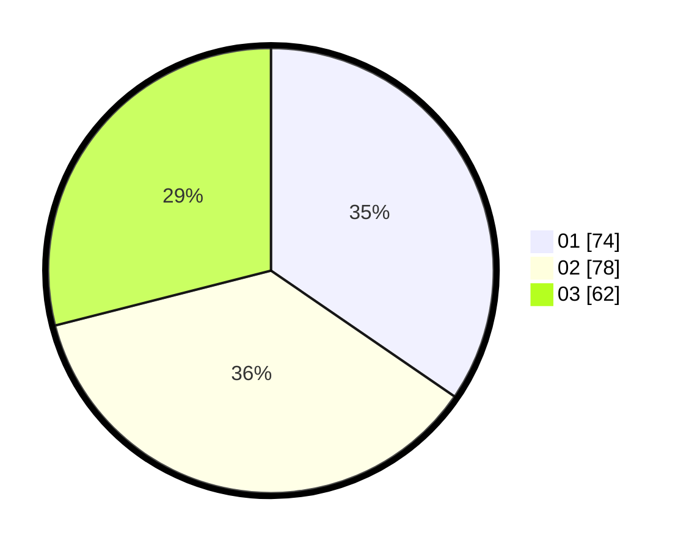

# Hasil

Hasil perolehan suara paslon dapat dilihat pada file paslon-01.txt, paslon-02.txt, dan paslon-03.txt.

Jika tidak ada, artinya data tersebut belum ada pada SIREKAP.

## Perolehan Suara

 * Paslon 01: **74**.
 * Paslon 02: **78**.
 * Paslon 03: **62**.

## Foto C Plano

https://sirekap-obj-formc.kpu.go.id/4bae/pemilu/ppwp/31/74/04/10/04/3174041004078-20240214-212341--9bf098a4-0b2b-4f4e-b277-7682fca1fa5f.jpg

https://sirekap-obj-formc.kpu.go.id/4bae/pemilu/ppwp/31/74/04/10/04/3174041004078-20240214-155041--0662afda-74d7-4d09-b716-cd10c73cda76.jpg

https://sirekap-obj-formc.kpu.go.id/4bae/pemilu/ppwp/31/74/04/10/04/3174041004078-20240214-212503--c42e70ec-c3e3-43f5-8b40-fb07b2818f80.jpg
