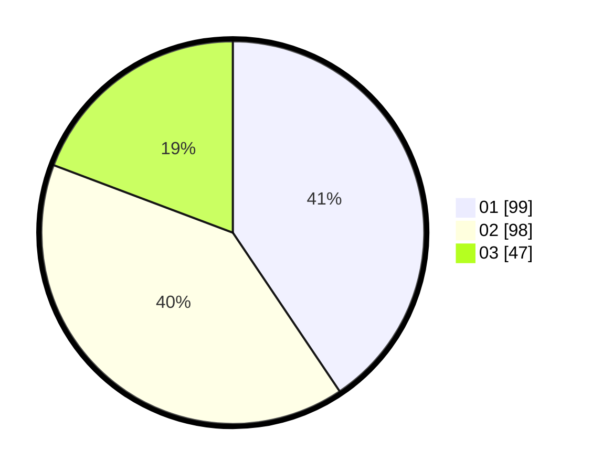

# Hasil

Hasil perolehan suara paslon dapat dilihat pada file paslon-01.txt, paslon-02.txt, dan paslon-03.txt.

Jika tidak ada, artinya data tersebut belum ada pada SIREKAP.

## Perolehan Suara

 * Paslon 01: **99**.
 * Paslon 02: **98**.
 * Paslon 03: **47**.

## Foto C Plano

https://sirekap-obj-formc.kpu.go.id/d7b6/pemilu/ppwp/31/74/04/10/04/3174041004079-20240214-201053--8897ab70-e5e5-4b12-8493-79faaccc4d93.jpg

https://sirekap-obj-formc.kpu.go.id/d7b6/pemilu/ppwp/31/74/04/10/04/3174041004079-20240214-195110--023e756e-bc40-4977-96a4-1e0613f0d2a4.jpg

https://sirekap-obj-formc.kpu.go.id/d7b6/pemilu/ppwp/31/74/04/10/04/3174041004079-20240214-201650--65ffb6da-b6b3-4748-8941-5c41eaa8e5a4.jpg

## DATA PEMILIH TETAP

Jumlah pemilih dalam DPT: **281**.
 * L: **130**.
 * P: **151**.

## DATA PENGGUNA HAK PILIH

Jumlah pengguna hak pilih dalam DPT: **238**.
 * L: **105**.
 * P: **130**.

Jumlah pengguna hak pilih dalam DPTb: **3**.
 * L: **0**.
 * P: **3**.

Jumlah pengguna hak pilih dalam DPK: **6**.
 * L: **4**.
 * P: **2**.

Jumlah pengguna hak pilih: **244**.
 * L: **109**.
 * P: **135**.

## JUMLAH SUARA SAH DAN TIDAK SAH

JUMLAH SELURUH SUARA SAH: **244**.

JUMLAH SUARA TIDAK SAH: **3**.

JUMLAH SELURUH SUARA SAH DAN SUARA TIDAK SAH: **247**.
