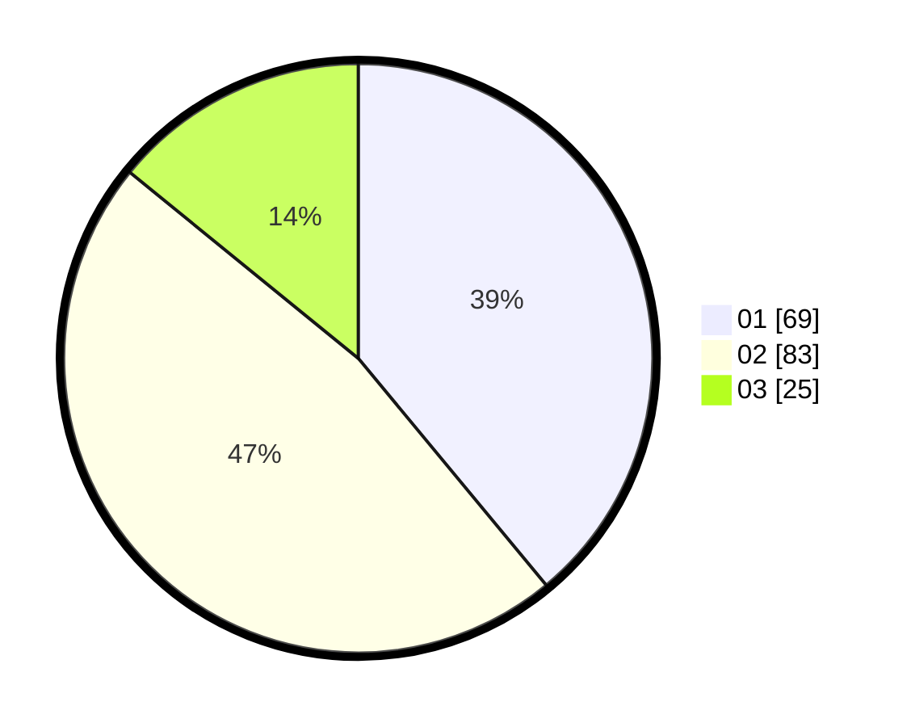

# Hasil

Hasil perolehan suara paslon dapat dilihat pada file paslon-01.txt, paslon-02.txt, dan paslon-03.txt.

Jika tidak ada, artinya data tersebut belum ada pada SIREKAP.

## Perolehan Suara

 * Paslon 01: **69**.
 * Paslon 02: **83**.
 * Paslon 03: **25**.

## Foto C Plano

https://sirekap-obj-formc.kpu.go.id/5a2b/pemilu/ppwp/31/74/04/10/04/3174041004088-20240215-002648--4106928c-0d50-4c0c-bde9-53e36980c76f.jpg

https://sirekap-obj-formc.kpu.go.id/5a2b/pemilu/ppwp/31/74/04/10/04/3174041004088-20240215-002127--bb755e1e-93a6-4a5d-9083-11b107b6ea63.jpg

https://sirekap-obj-formc.kpu.go.id/5a2b/pemilu/ppwp/31/74/04/10/04/3174041004088-20240215-002458--b7d55911-395a-45b1-b371-dc99d9083686.jpg

## DATA PEMILIH TETAP

Jumlah pemilih dalam DPT: **50**.
 * L: **104**.
 * P: **0**.

## DATA PENGGUNA HAK PILIH

Jumlah pengguna hak pilih dalam DPT: **555**.
 * L: **75**.
 * P: **555**.

Jumlah pengguna hak pilih dalam DPTb: **55**.
 * L: **4**.
 * P: **55**.

Jumlah pengguna hak pilih dalam DPK: **55**.
 * L: **0**.
 * P: **1**.

Jumlah pengguna hak pilih: **175**.
 * L: **83**.
 * P: **96**.

## JUMLAH SUARA SAH DAN TIDAK SAH

JUMLAH SELURUH SUARA SAH: **177**.

JUMLAH SUARA TIDAK SAH: **2**.

JUMLAH SELURUH SUARA SAH DAN SUARA TIDAK SAH: **179**.
