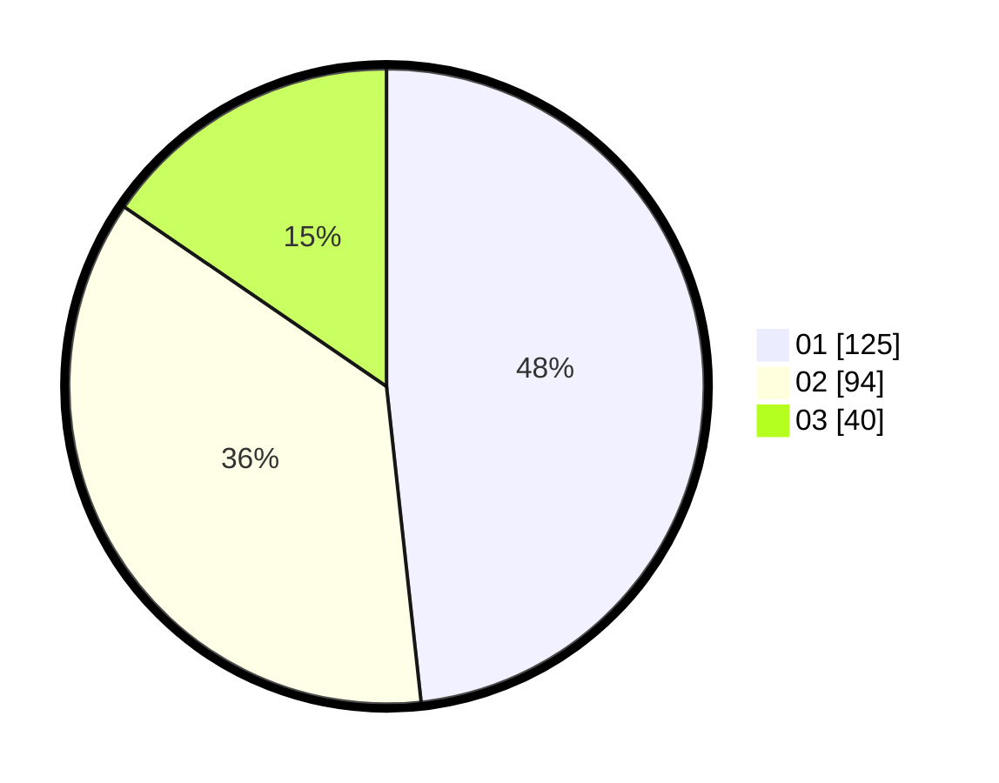

# Hasil

Hasil perolehan suara paslon dapat dilihat pada file paslon-01.txt, paslon-02.txt, dan paslon-03.txt.

Jika tidak ada, artinya data tersebut belum ada pada SIREKAP.

## Perolehan Suara

 * Paslon 01: **125**.
 * Paslon 02: **94**.
 * Paslon 03: **40**.

## Foto C Plano

https://sirekap-obj-formc.kpu.go.id/6e11/pemilu/ppwp/31/74/04/10/04/3174041004089-20240216-005854--797695a1-0b84-4361-9649-0af254aea6fb.jpg

https://sirekap-obj-formc.kpu.go.id/6e11/pemilu/ppwp/31/74/04/10/04/3174041004089-20240216-005856--5e1a525e-e3eb-4c70-a720-6f47fe8deaaf.jpg

https://sirekap-obj-formc.kpu.go.id/6e11/pemilu/ppwp/31/74/04/10/04/3174041004089-20240216-005855--08084d55-ca4f-402c-8faf-7fd9edfa97b5.jpg

## DATA PEMILIH TETAP

Jumlah pemilih dalam DPT: **272**.
 * L: **122**.
 * P: **150**.

## DATA PENGGUNA HAK PILIH

Jumlah pengguna hak pilih dalam DPT: **236**.
 * L: **103**.
 * P: **133**.

Jumlah pengguna hak pilih dalam DPTb: **24**.
 * L: **12**.
 * P: **12**.

Jumlah pengguna hak pilih dalam DPK: **2**.
 * L: **1**.
 * P: **1**.

Jumlah pengguna hak pilih: **262**.
 * L: **116**.
 * P: **146**.

## JUMLAH SUARA SAH DAN TIDAK SAH

JUMLAH SELURUH SUARA SAH: **259**.

JUMLAH SUARA TIDAK SAH: **3**.

JUMLAH SELURUH SUARA SAH DAN SUARA TIDAK SAH: **262**.
