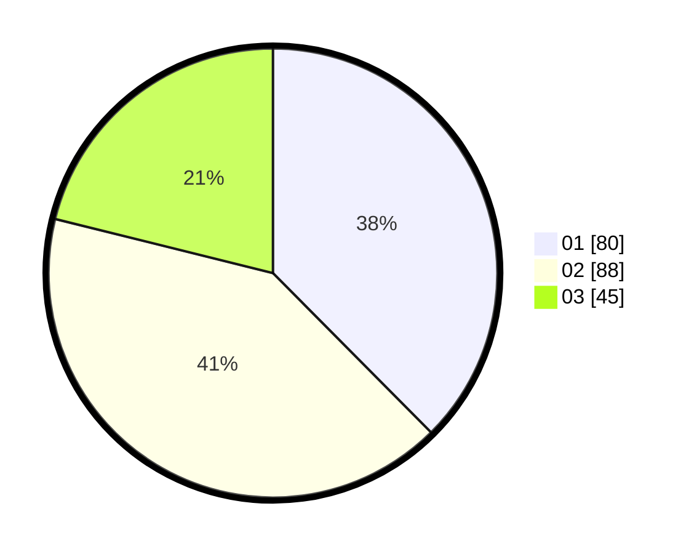

# Hasil

Hasil perolehan suara paslon dapat dilihat pada file paslon-01.txt, paslon-02.txt, dan paslon-03.txt.

Jika tidak ada, artinya data tersebut belum ada pada SIREKAP.

## Perolehan Suara

 * Paslon 01: **80**.
 * Paslon 02: **88**.
 * Paslon 03: **45**.

## Foto C Plano

https://sirekap-obj-formc.kpu.go.id/790e/pemilu/ppwp/31/74/04/10/04/3174041004090-20240217-165937--dea3af5f-6eaf-4360-85c1-10bf4c91217c.jpg

https://sirekap-obj-formc.kpu.go.id/790e/pemilu/ppwp/31/74/04/10/04/3174041004090-20240217-133411--0cbd2a48-228b-4559-960d-9410a4e2cd86.jpg

https://sirekap-obj-formc.kpu.go.id/790e/pemilu/ppwp/31/74/04/10/04/3174041004090-20240217-134055--ffeec975-f540-4b51-81e2-c8aec6371994.jpg

## DATA PEMILIH TETAP

Jumlah pemilih dalam DPT: **260**.
 * L: **126**.
 * P: **134**.

## DATA PENGGUNA HAK PILIH

Jumlah pengguna hak pilih dalam DPT: **206**.
 * L: **98**.
 * P: **108**.

Jumlah pengguna hak pilih dalam DPTb: **12**.
 * L: **6**.
 * P: **6**.

Jumlah pengguna hak pilih dalam DPK: **1**.
 * L: **0**.
 * P: **1**.

Jumlah pengguna hak pilih: **219**.
 * L: **104**.
 * P: **115**.

## JUMLAH SUARA SAH DAN TIDAK SAH

JUMLAH SELURUH SUARA SAH: **213**.

JUMLAH SUARA TIDAK SAH: **6**.

JUMLAH SELURUH SUARA SAH DAN SUARA TIDAK SAH: **219**.
