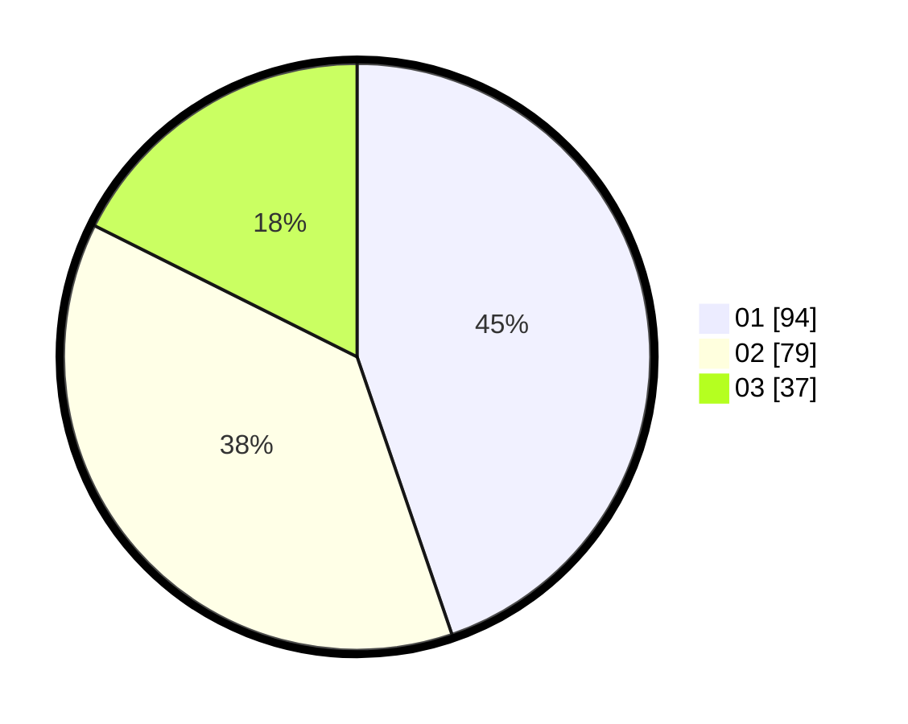

# Hasil

Hasil perolehan suara paslon dapat dilihat pada file paslon-01.txt, paslon-02.txt, dan paslon-03.txt.

Jika tidak ada, artinya data tersebut belum ada pada SIREKAP.

## Perolehan Suara

 * Paslon 01: **94**.
 * Paslon 02: **79**.
 * Paslon 03: **37**.

## Foto C Plano

https://sirekap-obj-formc.kpu.go.id/5d4a/pemilu/ppwp/31/74/04/10/04/3174041004103-20240214-213316--6ceb43dd-d3ad-48e6-b94c-6817486f711d.jpg

https://sirekap-obj-formc.kpu.go.id/5d4a/pemilu/ppwp/31/74/04/10/04/3174041004103-20240214-213524--a0cc175a-f968-489d-ac7c-f851f8a4cf01.jpg

https://sirekap-obj-formc.kpu.go.id/5d4a/pemilu/ppwp/31/74/04/10/04/3174041004103-20240214-213615--be47d1d0-4043-462c-adf7-4295c8ec8d61.jpg
