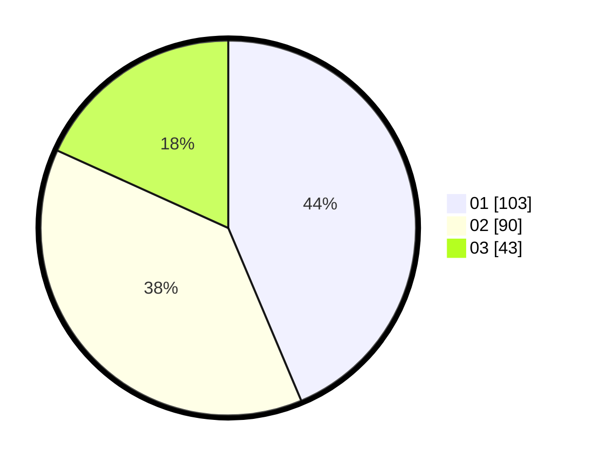

# Hasil

Hasil perolehan suara paslon dapat dilihat pada file paslon-01.txt, paslon-02.txt, dan paslon-03.txt.

Jika tidak ada, artinya data tersebut belum ada pada SIREKAP.

## Perolehan Suara

 * Paslon 01: **103**.
 * Paslon 02: **90**.
 * Paslon 03: **43**.

## Foto C Plano

https://sirekap-obj-formc.kpu.go.id/4495/pemilu/ppwp/31/74/04/10/04/3174041004104-20240214-155729--47b3c189-2b0f-4223-9c0f-1402ec86973d.jpg

https://sirekap-obj-formc.kpu.go.id/4495/pemilu/ppwp/31/74/04/10/04/3174041004104-20240214-155837--706ed851-db46-4c8f-8f4d-c0706abba2a0.jpg

https://sirekap-obj-formc.kpu.go.id/4495/pemilu/ppwp/31/74/04/10/04/3174041004104-20240214-160102--f6696da1-a8d2-4d7b-aaf9-dfdeead49272.jpg

## DATA PEMILIH TETAP

Jumlah pemilih dalam DPT: **272**.
 * L: **139**.
 * P: **133**.

## DATA PENGGUNA HAK PILIH

Jumlah pengguna hak pilih dalam DPT: **236**.
 * L: **116**.
 * P: **120**.

Jumlah pengguna hak pilih dalam DPTb: **0**.
 * L: **0**.
 * P: **0**.

Jumlah pengguna hak pilih dalam DPK: **3**.
 * L: **0**.
 * P: **3**.

Jumlah pengguna hak pilih: **239**.
 * L: **116**.
 * P: **123**.

## JUMLAH SUARA SAH DAN TIDAK SAH

JUMLAH SELURUH SUARA SAH: **236**.

JUMLAH SUARA TIDAK SAH: **3**.

JUMLAH SELURUH SUARA SAH DAN SUARA TIDAK SAH: **239**.
