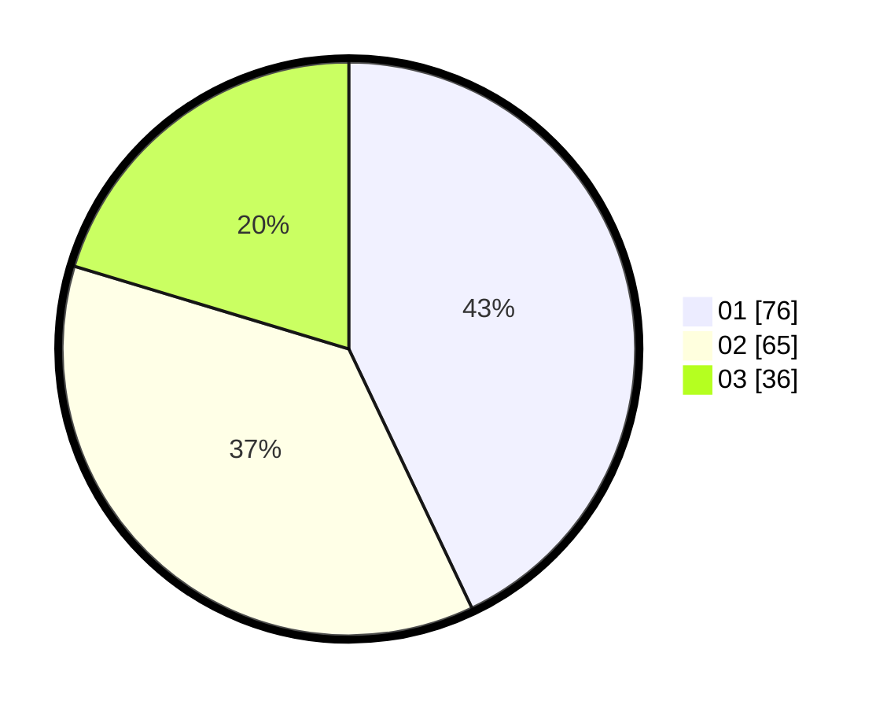

# Hasil

Hasil perolehan suara paslon dapat dilihat pada file paslon-01.txt, paslon-02.txt, dan paslon-03.txt.

Jika tidak ada, artinya data tersebut belum ada pada SIREKAP.

## Perolehan Suara

 * Paslon 01: **76**.
 * Paslon 02: **65**.
 * Paslon 03: **36**.

## Foto C Plano

https://sirekap-obj-formc.kpu.go.id/fd93/pemilu/ppwp/31/74/04/10/04/3174041004109-20240217-211212--f1f07ab9-ae68-44eb-bd21-f6823497dab0.jpg

https://sirekap-obj-formc.kpu.go.id/fd93/pemilu/ppwp/31/74/04/10/04/3174041004109-20240214-215239--dbe15df8-c221-42ad-88cd-0733ab0c5a75.jpg

https://sirekap-obj-formc.kpu.go.id/fd93/pemilu/ppwp/31/74/04/10/04/3174041004109-20240214-192625--8b09f24d-b196-4d33-8284-fc94629567f8.jpg

## DATA PEMILIH TETAP

Jumlah pemilih dalam DPT: **203**.
 * L: **101**.
 * P: **102**.

## DATA PENGGUNA HAK PILIH

Jumlah pengguna hak pilih dalam DPT: **170**.
 * L: **82**.
 * P: **88**.

Jumlah pengguna hak pilih dalam DPTb: **9**.
 * L: **5**.
 * P: **4**.

Jumlah pengguna hak pilih dalam DPK: **2**.
 * L: **1**.
 * P: **1**.

Jumlah pengguna hak pilih: **181**.
 * L: **88**.
 * P: **93**.

## JUMLAH SUARA SAH DAN TIDAK SAH

JUMLAH SELURUH SUARA SAH: **177**.

JUMLAH SUARA TIDAK SAH: **4**.

JUMLAH SELURUH SUARA SAH DAN SUARA TIDAK SAH: **181**.
