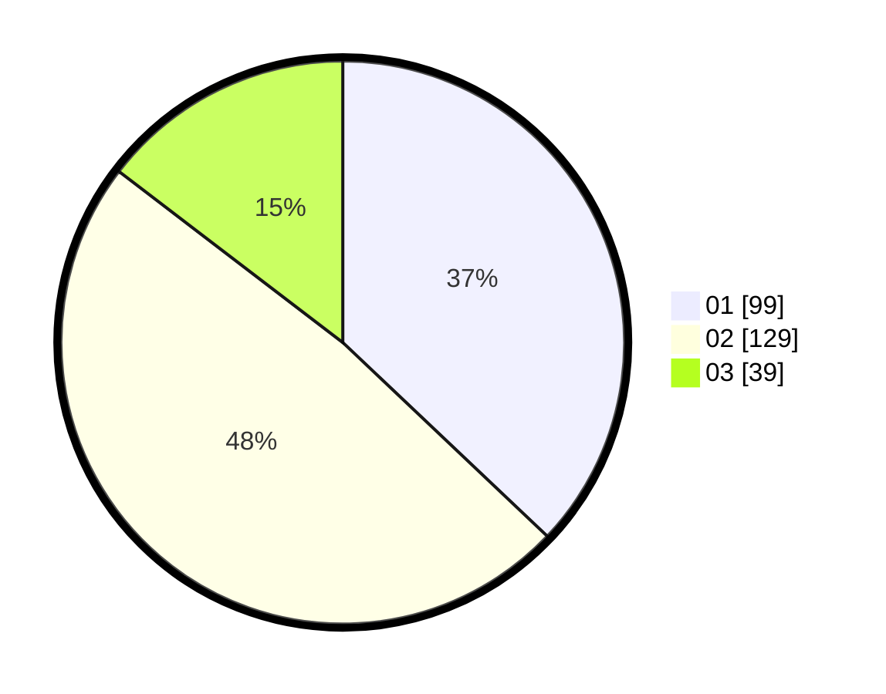

# Hasil

Hasil perolehan suara paslon dapat dilihat pada file paslon-01.txt, paslon-02.txt, dan paslon-03.txt.

Jika tidak ada, artinya data tersebut belum ada pada SIREKAP.

## Perolehan Suara

 * Paslon 01: **99**.
 * Paslon 02: **129**.
 * Paslon 03: **39**.

## Foto C Plano

https://sirekap-obj-formc.kpu.go.id/3dc7/pemilu/ppwp/31/74/04/10/04/3174041004120-20240214-235713--37805ba9-a9f8-445f-a600-301bcfe0fbb3.jpg

https://sirekap-obj-formc.kpu.go.id/3dc7/pemilu/ppwp/31/74/04/10/04/3174041004120-20240214-235840--2bb66b64-3996-4d73-920a-378fa3841762.jpg

https://sirekap-obj-formc.kpu.go.id/3dc7/pemilu/ppwp/31/74/04/10/04/3174041004120-20240214-235929--1aee44a5-164d-4be9-85da-3edbe5b606ae.jpg

## DATA PEMILIH TETAP

Jumlah pemilih dalam DPT: **286**.
 * L: **140**.
 * P: **146**.

## DATA PENGGUNA HAK PILIH

Jumlah pengguna hak pilih dalam DPT: **253**.
 * L: **116**.
 * P: **137**.

Jumlah pengguna hak pilih dalam DPTb: **14**.
 * L: **12**.
 * P: **2**.

Jumlah pengguna hak pilih dalam DPK: **2**.
 * L: **1**.
 * P: **1**.

Jumlah pengguna hak pilih: **269**.
 * L: **129**.
 * P: **140**.

## JUMLAH SUARA SAH DAN TIDAK SAH

JUMLAH SELURUH SUARA SAH: **267**.

JUMLAH SUARA TIDAK SAH: **2**.

JUMLAH SELURUH SUARA SAH DAN SUARA TIDAK SAH: **269**.
