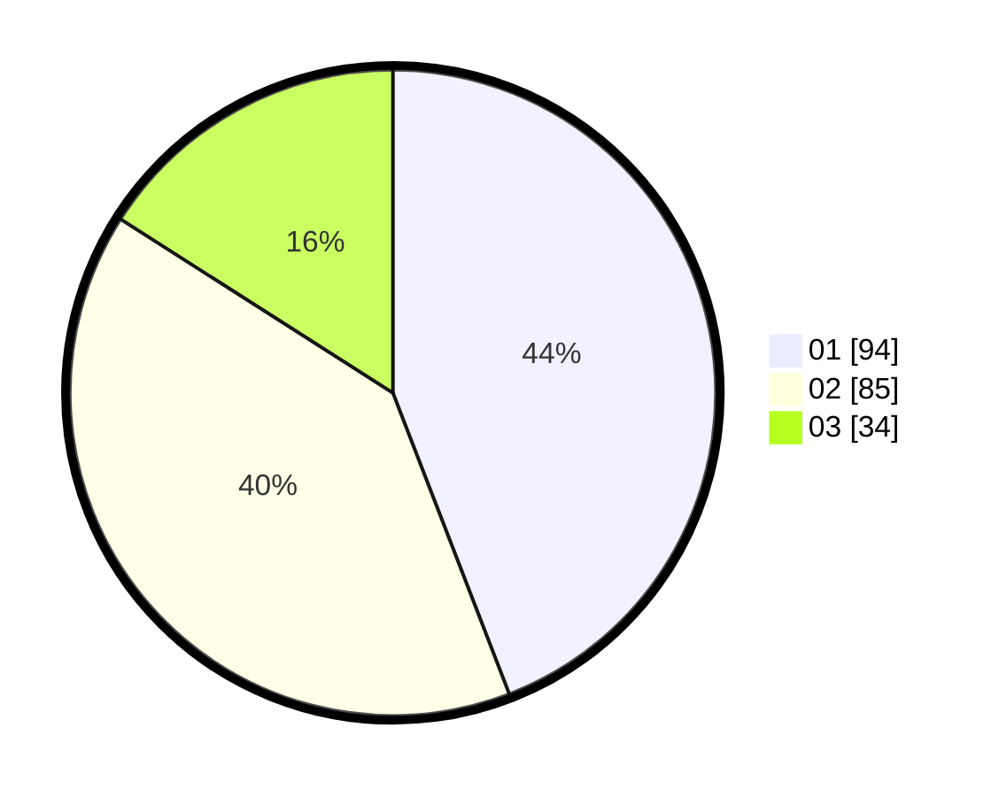

# Hasil

Hasil perolehan suara paslon dapat dilihat pada file paslon-01.txt, paslon-02.txt, dan paslon-03.txt.

Jika tidak ada, artinya data tersebut belum ada pada SIREKAP.

## Perolehan Suara

 * Paslon 01: **94**.
 * Paslon 02: **85**.
 * Paslon 03: **34**.

## Foto C Plano

https://sirekap-obj-formc.kpu.go.id/34b9/pemilu/ppwp/31/74/04/10/04/3174041004122-20240214-223821--1ae7835b-b32b-4a44-911b-f0ef7a05db0f.jpg

https://sirekap-obj-formc.kpu.go.id/34b9/pemilu/ppwp/31/74/04/10/04/3174041004122-20240214-224035--28c5156a-efea-4673-b26c-05f8c6a68cbc.jpg

https://sirekap-obj-formc.kpu.go.id/34b9/pemilu/ppwp/31/74/04/10/04/3174041004122-20240214-224225--d08be5f9-f9b0-494b-a36b-6d7967e17718.jpg
