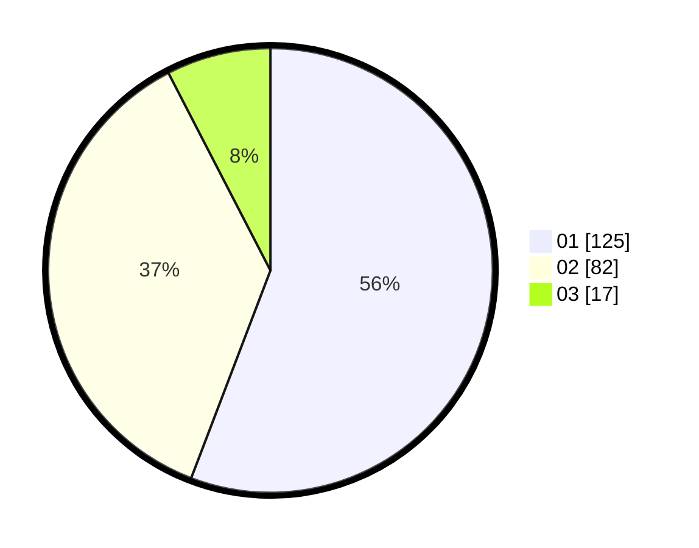

# Hasil

Hasil perolehan suara paslon dapat dilihat pada file paslon-01.txt, paslon-02.txt, dan paslon-03.txt.

Jika tidak ada, artinya data tersebut belum ada pada SIREKAP.

## Perolehan Suara

 * Paslon 01: **125**.
 * Paslon 02: **82**.
 * Paslon 03: **17**.

## Foto C Plano

https://sirekap-obj-formc.kpu.go.id/ab33/pemilu/ppwp/31/74/04/10/05/3174041005004-20240214-155040--2042b096-094a-4ee2-8083-a82c60bb8638.jpg

https://sirekap-obj-formc.kpu.go.id/ab33/pemilu/ppwp/31/74/04/10/05/3174041005004-20240214-155555--3e8a1d09-0e9d-4943-ad2f-242c05ae7c93.jpg

https://sirekap-obj-formc.kpu.go.id/ab33/pemilu/ppwp/31/74/04/10/05/3174041005004-20240214-184533--2ddbaf1a-59ff-441c-9d61-6e1b08ce3926.jpg

## DATA PEMILIH TETAP

Jumlah pemilih dalam DPT: **263**.
 * L: **137**.
 * P: **126**.

## DATA PENGGUNA HAK PILIH

Jumlah pengguna hak pilih dalam DPT: **216**.
 * L: **111**.
 * P: **105**.

Jumlah pengguna hak pilih dalam DPTb: **7**.
 * L: **3**.
 * P: **4**.

Jumlah pengguna hak pilih dalam DPK: **3**.
 * L: **1**.
 * P: **2**.

Jumlah pengguna hak pilih: **226**.
 * L: **115**.
 * P: **111**.

## JUMLAH SUARA SAH DAN TIDAK SAH

JUMLAH SELURUH SUARA SAH: **224**.

JUMLAH SUARA TIDAK SAH: **2**.

JUMLAH SELURUH SUARA SAH DAN SUARA TIDAK SAH: **226**.
