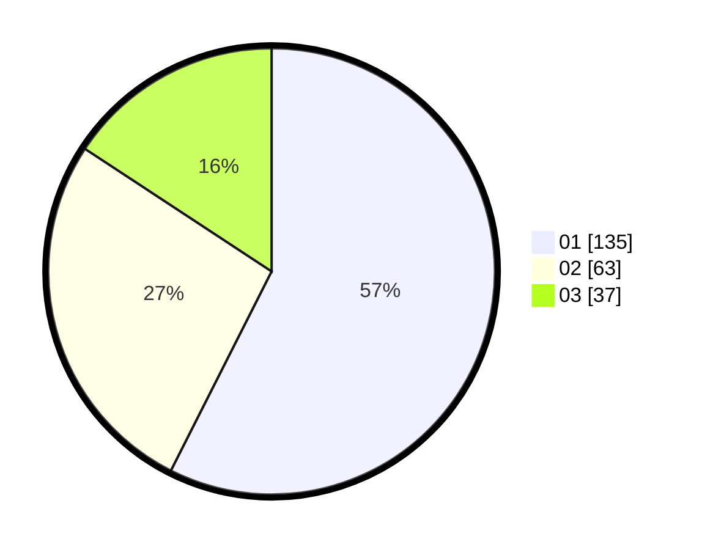

# Hasil

Hasil perolehan suara paslon dapat dilihat pada file paslon-01.txt, paslon-02.txt, dan paslon-03.txt.

Jika tidak ada, artinya data tersebut belum ada pada SIREKAP.

## Perolehan Suara

 * Paslon 01: **135**.
 * Paslon 02: **63**.
 * Paslon 03: **37**.

## Foto C Plano

https://sirekap-obj-formc.kpu.go.id/d1ef/pemilu/ppwp/31/74/04/10/05/3174041005011-20240214-195751--4146e535-1dc6-415c-ad44-42bd4850dcef.jpg

https://sirekap-obj-formc.kpu.go.id/d1ef/pemilu/ppwp/31/74/04/10/05/3174041005011-20240214-193938--5bb5aeaf-6ebb-4db7-b8e8-4d281ec0a764.jpg

https://sirekap-obj-formc.kpu.go.id/d1ef/pemilu/ppwp/31/74/04/10/05/3174041005011-20240214-194042--e6997f4d-bf98-4c41-af19-9f6f814d55ee.jpg

## DATA PEMILIH TETAP

Jumlah pemilih dalam DPT: **274**.
 * L: **128**.
 * P: **146**.

## DATA PENGGUNA HAK PILIH

Jumlah pengguna hak pilih dalam DPT: **224**.
 * L: **102**.
 * P: **122**.

Jumlah pengguna hak pilih dalam DPTb: **13**.
 * L: **11**.
 * P: **2**.

Jumlah pengguna hak pilih dalam DPK: **1**.
 * L: **0**.
 * P: **1**.

Jumlah pengguna hak pilih: **238**.
 * L: **113**.
 * P: **125**.

## JUMLAH SUARA SAH DAN TIDAK SAH

JUMLAH SELURUH SUARA SAH: **235**.

JUMLAH SUARA TIDAK SAH: **3**.

JUMLAH SELURUH SUARA SAH DAN SUARA TIDAK SAH: **238**.
