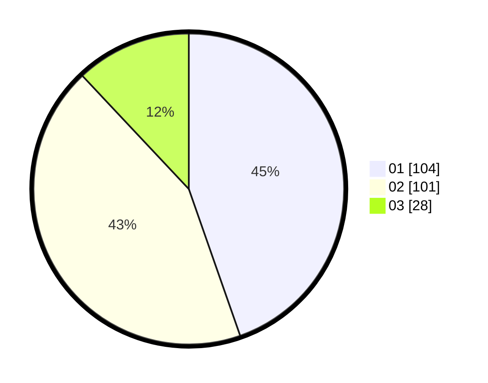

# Hasil

Hasil perolehan suara paslon dapat dilihat pada file paslon-01.txt, paslon-02.txt, dan paslon-03.txt.

Jika tidak ada, artinya data tersebut belum ada pada SIREKAP.

## Perolehan Suara

 * Paslon 01: **104**.
 * Paslon 02: **101**.
 * Paslon 03: **28**.

## Foto C Plano

https://sirekap-obj-formc.kpu.go.id/5a35/pemilu/ppwp/31/74/04/10/05/3174041005012-20240215-085345--25a144ac-ff11-445c-97bc-2e3ee6fada8a.jpg

https://sirekap-obj-formc.kpu.go.id/5a35/pemilu/ppwp/31/74/04/10/05/3174041005012-20240215-085406--a55e723b-226b-4355-86f2-91c473f784d1.jpg

https://sirekap-obj-formc.kpu.go.id/5a35/pemilu/ppwp/31/74/04/10/05/3174041005012-20240215-085355--526947f1-096f-4387-87a7-a4c588e1f50b.jpg

## DATA PEMILIH TETAP

Jumlah pemilih dalam DPT: **267**.
 * L: **131**.
 * P: **136**.

## DATA PENGGUNA HAK PILIH

Jumlah pengguna hak pilih dalam DPT: **224**.
 * L: **109**.
 * P: **115**.

Jumlah pengguna hak pilih dalam DPTb: **8**.
 * L: **4**.
 * P: **4**.

Jumlah pengguna hak pilih dalam DPK: **3**.
 * L: **1**.
 * P: **2**.

Jumlah pengguna hak pilih: **235**.
 * L: **114**.
 * P: **121**.

## JUMLAH SUARA SAH DAN TIDAK SAH

JUMLAH SELURUH SUARA SAH: **233**.

JUMLAH SUARA TIDAK SAH: **2**.

JUMLAH SELURUH SUARA SAH DAN SUARA TIDAK SAH: **235**.
