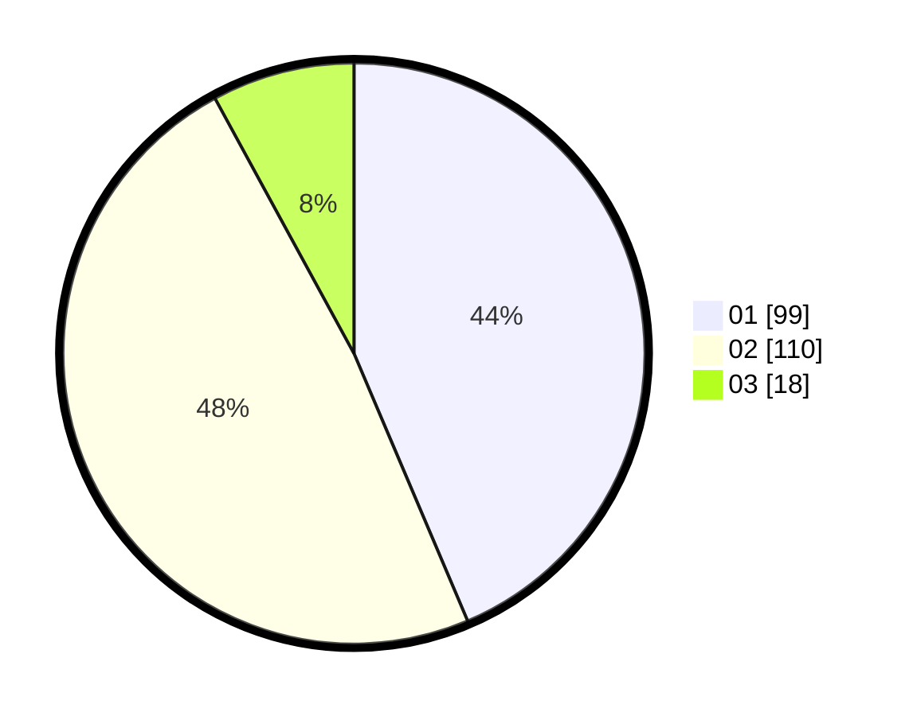

# Hasil

Hasil perolehan suara paslon dapat dilihat pada file paslon-01.txt, paslon-02.txt, dan paslon-03.txt.

Jika tidak ada, artinya data tersebut belum ada pada SIREKAP.

## Perolehan Suara

 * Paslon 01: **99**.
 * Paslon 02: **110**.
 * Paslon 03: **18**.

## Foto C Plano

https://sirekap-obj-formc.kpu.go.id/0e1d/pemilu/ppwp/31/74/04/10/05/3174041005017-20240214-155735--7d0f249b-56c4-48b4-b8c8-e96524cdf3f7.jpg

https://sirekap-obj-formc.kpu.go.id/0e1d/pemilu/ppwp/31/74/04/10/05/3174041005017-20240214-155800--073e9403-0a1a-4604-9065-ca2f3b1fa8b7.jpg

https://sirekap-obj-formc.kpu.go.id/0e1d/pemilu/ppwp/31/74/04/10/05/3174041005017-20240214-155837--b83e7157-e70a-4c1c-8510-a41b90c35f36.jpg

## DATA PEMILIH TETAP

Jumlah pemilih dalam DPT: **261**.
 * L: **129**.
 * P: **132**.

## DATA PENGGUNA HAK PILIH

Jumlah pengguna hak pilih dalam DPT: **215**.
 * L: **103**.
 * P: **112**.

Jumlah pengguna hak pilih dalam DPTb: **8**.
 * L: **2**.
 * P: **6**.

Jumlah pengguna hak pilih dalam DPK: **6**.
 * L: **2**.
 * P: **4**.

Jumlah pengguna hak pilih: **229**.
 * L: **107**.
 * P: **122**.

## JUMLAH SUARA SAH DAN TIDAK SAH

JUMLAH SELURUH SUARA SAH: **227**.

JUMLAH SUARA TIDAK SAH: **2**.

JUMLAH SELURUH SUARA SAH DAN SUARA TIDAK SAH: **229**.
