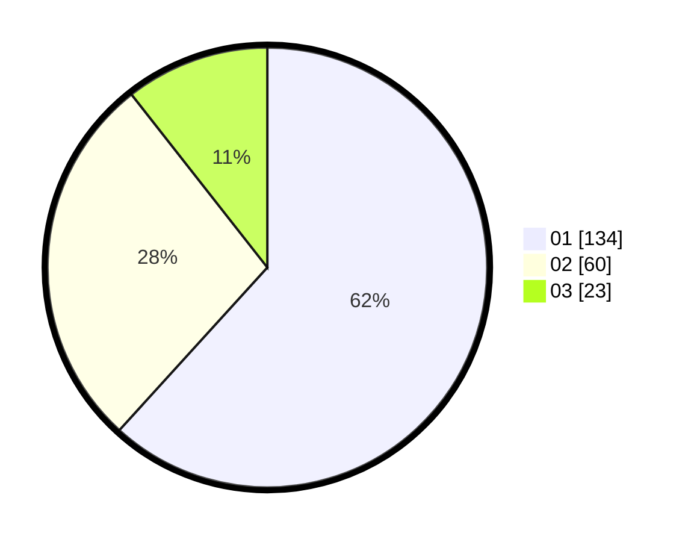

# Hasil

Hasil perolehan suara paslon dapat dilihat pada file paslon-01.txt, paslon-02.txt, dan paslon-03.txt.

Jika tidak ada, artinya data tersebut belum ada pada SIREKAP.

## Perolehan Suara

 * Paslon 01: **134**.
 * Paslon 02: **60**.
 * Paslon 03: **23**.

## Foto C Plano

https://sirekap-obj-formc.kpu.go.id/b35e/pemilu/ppwp/31/74/04/10/05/3174041005019-20240214-194041--c6ecf301-0b2a-48c7-a680-2e8d50bbe2a6.jpg

https://sirekap-obj-formc.kpu.go.id/b35e/pemilu/ppwp/31/74/04/10/05/3174041005019-20240214-201800--b91babeb-417b-433d-9b6b-bcac0a0d8c1a.jpg

https://sirekap-obj-formc.kpu.go.id/b35e/pemilu/ppwp/31/74/04/10/05/3174041005019-20240214-201702--3bbe6a83-f99f-4bcb-af32-03fc1c07eb70.jpg

## DATA PEMILIH TETAP

Jumlah pemilih dalam DPT: **253**.
 * L: **125**.
 * P: **128**.

## DATA PENGGUNA HAK PILIH

Jumlah pengguna hak pilih dalam DPT: **206**.
 * L: **106**.
 * P: **100**.

Jumlah pengguna hak pilih dalam DPTb: **10**.
 * L: **8**.
 * P: **2**.

Jumlah pengguna hak pilih dalam DPK: **2**.
 * L: **1**.
 * P: **1**.

Jumlah pengguna hak pilih: **218**.
 * L: **115**.
 * P: **103**.

## JUMLAH SUARA SAH DAN TIDAK SAH

JUMLAH SELURUH SUARA SAH: **217**.

JUMLAH SUARA TIDAK SAH: **1**.

JUMLAH SELURUH SUARA SAH DAN SUARA TIDAK SAH: **218**.
