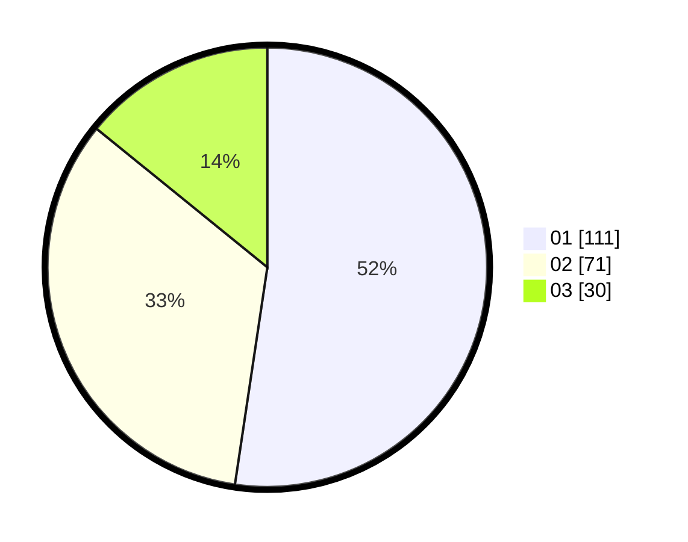

# Hasil

Hasil perolehan suara paslon dapat dilihat pada file paslon-01.txt, paslon-02.txt, dan paslon-03.txt.

Jika tidak ada, artinya data tersebut belum ada pada SIREKAP.

## Perolehan Suara

 * Paslon 01: **111**.
 * Paslon 02: **71**.
 * Paslon 03: **30**.

## Foto C Plano

https://sirekap-obj-formc.kpu.go.id/14b0/pemilu/ppwp/31/74/04/10/05/3174041005021-20240214-193601--3e1be33a-a172-4507-ae62-8fee5ff68d5d.jpg

https://sirekap-obj-formc.kpu.go.id/14b0/pemilu/ppwp/31/74/04/10/05/3174041005021-20240214-162229--87865c9e-aec7-4ebb-8162-512c77c6535d.jpg

https://sirekap-obj-formc.kpu.go.id/14b0/pemilu/ppwp/31/74/04/10/05/3174041005021-20240214-193605--a79fb3cb-d6ad-4615-86f6-d734d31fd7a1.jpg

## DATA PEMILIH TETAP

Jumlah pemilih dalam DPT: **261**.
 * L: **129**.
 * P: **132**.

## DATA PENGGUNA HAK PILIH

Jumlah pengguna hak pilih dalam DPT: **208**.
 * L: **102**.
 * P: **106**.

Jumlah pengguna hak pilih dalam DPTb: **2**.
 * L: **0**.
 * P: **2**.

Jumlah pengguna hak pilih dalam DPK: **4**.
 * L: **2**.
 * P: **2**.

Jumlah pengguna hak pilih: **214**.
 * L: **104**.
 * P: **110**.

## JUMLAH SUARA SAH DAN TIDAK SAH

JUMLAH SELURUH SUARA SAH: **212**.

JUMLAH SUARA TIDAK SAH: **2**.

JUMLAH SELURUH SUARA SAH DAN SUARA TIDAK SAH: **214**.
