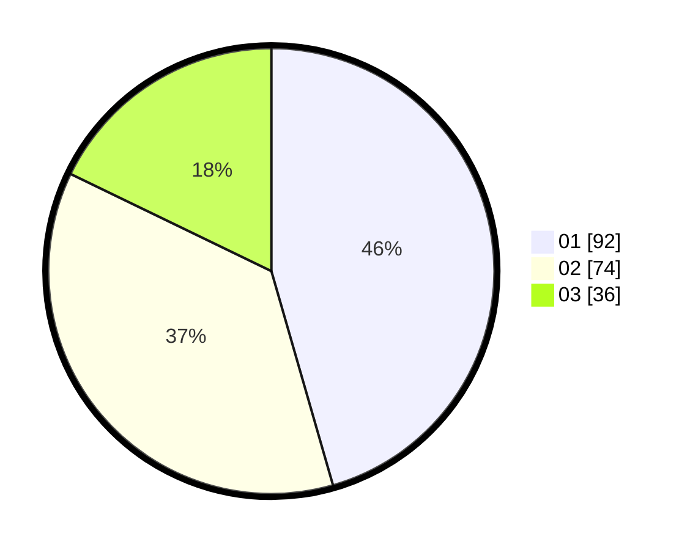

# Hasil

Hasil perolehan suara paslon dapat dilihat pada file paslon-01.txt, paslon-02.txt, dan paslon-03.txt.

Jika tidak ada, artinya data tersebut belum ada pada SIREKAP.

## Perolehan Suara

 * Paslon 01: **92**.
 * Paslon 02: **74**.
 * Paslon 03: **36**.

## Foto C Plano

https://sirekap-obj-formc.kpu.go.id/f91b/pemilu/ppwp/31/74/04/10/05/3174041005022-20240214-201042--90a418e6-3c4d-4d5f-9d9e-10a69d983ab3.jpg

https://sirekap-obj-formc.kpu.go.id/f91b/pemilu/ppwp/31/74/04/10/05/3174041005022-20240214-201159--b79b7299-0cc4-40c6-8132-add78673cf12.jpg

https://sirekap-obj-formc.kpu.go.id/f91b/pemilu/ppwp/31/74/04/10/05/3174041005022-20240214-201313--4b301e91-bf4d-44b9-850e-077bf6da6940.jpg

## DATA PEMILIH TETAP

Jumlah pemilih dalam DPT: **257**.
 * L: **141**.
 * P: **116**.

## DATA PENGGUNA HAK PILIH

Jumlah pengguna hak pilih dalam DPT: **193**.
 * L: **100**.
 * P: **93**.

Jumlah pengguna hak pilih dalam DPTb: **3**.
 * L: **1**.
 * P: **2**.

Jumlah pengguna hak pilih dalam DPK: **7**.
 * L: **2**.
 * P: **5**.

Jumlah pengguna hak pilih: **203**.
 * L: **103**.
 * P: **100**.

## JUMLAH SUARA SAH DAN TIDAK SAH

JUMLAH SELURUH SUARA SAH: **202**.

JUMLAH SUARA TIDAK SAH: **1**.

JUMLAH SELURUH SUARA SAH DAN SUARA TIDAK SAH: **203**.
