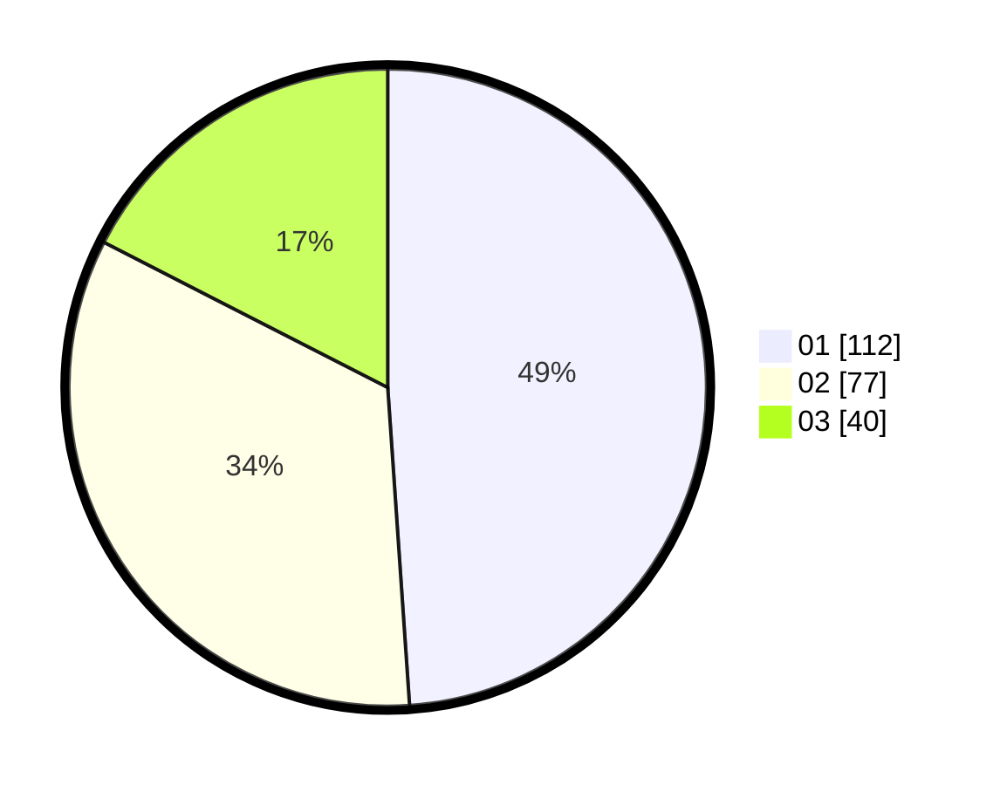

# Hasil

Hasil perolehan suara paslon dapat dilihat pada file paslon-01.txt, paslon-02.txt, dan paslon-03.txt.

Jika tidak ada, artinya data tersebut belum ada pada SIREKAP.

## Perolehan Suara

 * Paslon 01: **112**.
 * Paslon 02: **77**.
 * Paslon 03: **40**.

## Foto C Plano

https://sirekap-obj-formc.kpu.go.id/a204/pemilu/ppwp/31/74/04/10/05/3174041005024-20240214-185446--aa006524-7ba3-4bb0-9529-55b134daf528.jpg

https://sirekap-obj-formc.kpu.go.id/a204/pemilu/ppwp/31/74/04/10/05/3174041005024-20240214-185454--c37f000a-68f8-4395-804e-e65a9cb05983.jpg

https://sirekap-obj-formc.kpu.go.id/a204/pemilu/ppwp/31/74/04/10/05/3174041005024-20240214-185459--c4e72af9-31ad-4cde-9e04-be4af450019e.jpg

## DATA PEMILIH TETAP

Jumlah pemilih dalam DPT: **260**.
 * L: **119**.
 * P: **141**.

## DATA PENGGUNA HAK PILIH

Jumlah pengguna hak pilih dalam DPT: **223**.
 * L: **102**.
 * P: **121**.

Jumlah pengguna hak pilih dalam DPTb: **4**.
 * L: **3**.
 * P: **1**.

Jumlah pengguna hak pilih dalam DPK: **2**.
 * L: **1**.
 * P: **1**.

Jumlah pengguna hak pilih: **229**.
 * L: **106**.
 * P: **123**.

## JUMLAH SUARA SAH DAN TIDAK SAH

JUMLAH SELURUH SUARA SAH: **229**.

JUMLAH SUARA TIDAK SAH: **4**.

JUMLAH SELURUH SUARA SAH DAN SUARA TIDAK SAH: **233**.
