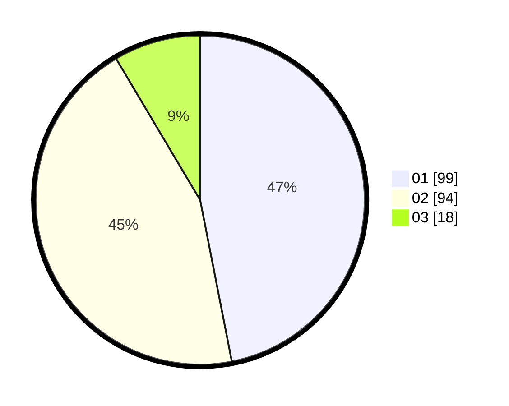

# Hasil

Hasil perolehan suara paslon dapat dilihat pada file paslon-01.txt, paslon-02.txt, dan paslon-03.txt.

Jika tidak ada, artinya data tersebut belum ada pada SIREKAP.

## Perolehan Suara

 * Paslon 01: **99**.
 * Paslon 02: **94**.
 * Paslon 03: **18**.

## Foto C Plano

https://sirekap-obj-formc.kpu.go.id/fd10/pemilu/ppwp/31/74/04/10/05/3174041005038-20240214-190827--68f69c28-c57a-4b12-bcdb-cf910182b783.jpg

https://sirekap-obj-formc.kpu.go.id/fd10/pemilu/ppwp/31/74/04/10/05/3174041005038-20240214-191027--e028bab0-7c8c-42fe-8935-04c56e5bdd7e.jpg

https://sirekap-obj-formc.kpu.go.id/fd10/pemilu/ppwp/31/74/04/10/05/3174041005038-20240214-190916--01c91f48-cf34-4a70-ba4f-14ec27d58a9b.jpg

## DATA PEMILIH TETAP

Jumlah pemilih dalam DPT: **258**.
 * L: **126**.
 * P: **132**.

## DATA PENGGUNA HAK PILIH

Jumlah pengguna hak pilih dalam DPT: **212**.
 * L: **100**.
 * P: **113**.

Jumlah pengguna hak pilih dalam DPTb: **0**.
 * L: **0**.
 * P: **0**.

Jumlah pengguna hak pilih dalam DPK: **1**.
 * L: **1**.
 * P: **0**.

Jumlah pengguna hak pilih: **213**.
 * L: **100**.
 * P: **113**.

## JUMLAH SUARA SAH DAN TIDAK SAH

JUMLAH SELURUH SUARA SAH: **211**.

JUMLAH SUARA TIDAK SAH: **2**.

JUMLAH SELURUH SUARA SAH DAN SUARA TIDAK SAH: **213**.
