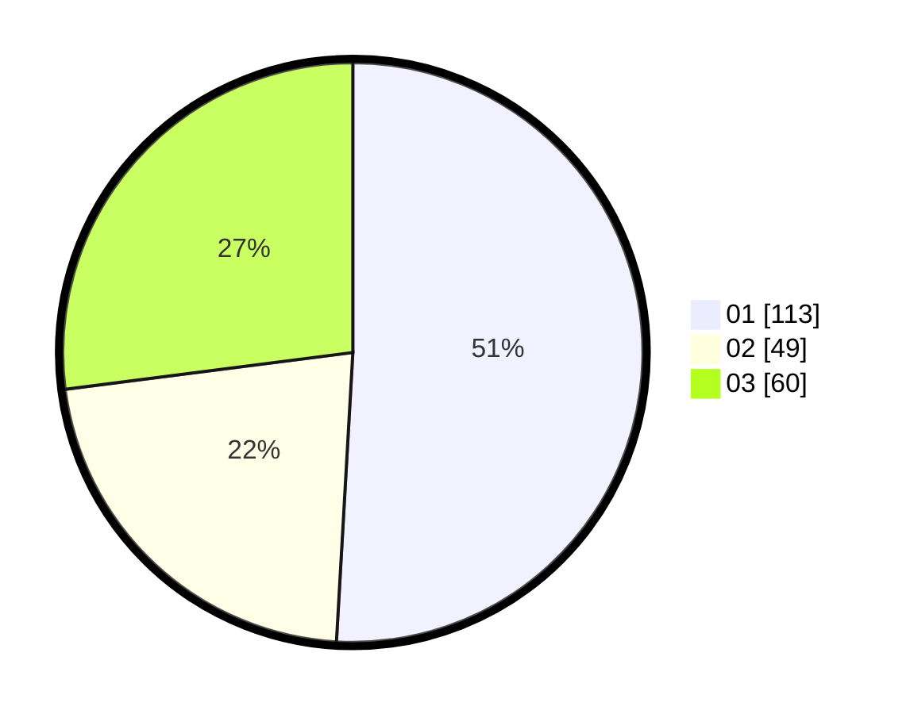

# Hasil

Hasil perolehan suara paslon dapat dilihat pada file paslon-01.txt, paslon-02.txt, dan paslon-03.txt.

Jika tidak ada, artinya data tersebut belum ada pada SIREKAP.

## Perolehan Suara

 * Paslon 01: **113**.
 * Paslon 02: **49**.
 * Paslon 03: **60**.

## Foto C Plano

https://sirekap-obj-formc.kpu.go.id/df89/pemilu/ppwp/31/74/04/10/05/3174041005044-20240214-155256--5c62cf31-2de9-4331-8965-7cfec9a54760.jpg

https://sirekap-obj-formc.kpu.go.id/df89/pemilu/ppwp/31/74/04/10/05/3174041005044-20240214-155922--35e36048-0a2b-42b9-bd99-7f512dac52d3.jpg

https://sirekap-obj-formc.kpu.go.id/df89/pemilu/ppwp/31/74/04/10/05/3174041005044-20240214-190446--fe576c1f-9111-4f0e-9ed8-22401020ee63.jpg

## DATA PEMILIH TETAP

Jumlah pemilih dalam DPT: **260**.
 * L: **128**.
 * P: **132**.

## DATA PENGGUNA HAK PILIH

Jumlah pengguna hak pilih dalam DPT: **217**.
 * L: **103**.
 * P: **114**.

Jumlah pengguna hak pilih dalam DPTb: **5**.
 * L: **2**.
 * P: **3**.

Jumlah pengguna hak pilih dalam DPK: **4**.
 * L: **2**.
 * P: **2**.

Jumlah pengguna hak pilih: **226**.
 * L: **107**.
 * P: **119**.

## JUMLAH SUARA SAH DAN TIDAK SAH

JUMLAH SELURUH SUARA SAH: **222**.

JUMLAH SUARA TIDAK SAH: **4**.

JUMLAH SELURUH SUARA SAH DAN SUARA TIDAK SAH: **226**.
