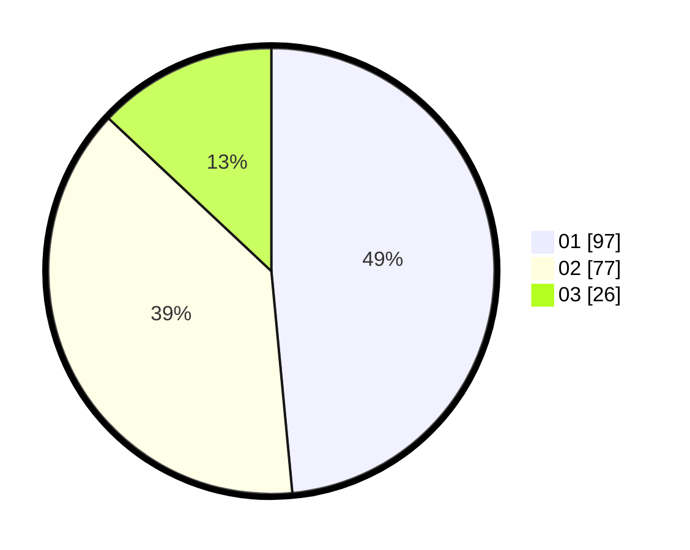

# Hasil

Hasil perolehan suara paslon dapat dilihat pada file paslon-01.txt, paslon-02.txt, dan paslon-03.txt.

Jika tidak ada, artinya data tersebut belum ada pada SIREKAP.

## Perolehan Suara

 * Paslon 01: **97**.
 * Paslon 02: **77**.
 * Paslon 03: **26**.

## Foto C Plano

https://sirekap-obj-formc.kpu.go.id/bd0a/pemilu/ppwp/31/74/04/10/05/3174041005089-20240215-032017--af211ba3-9ad5-4523-bdbd-f34f33b6dc94.jpg

https://sirekap-obj-formc.kpu.go.id/bd0a/pemilu/ppwp/31/74/04/10/05/3174041005089-20240215-013607--f11a28d8-c892-4b8a-938b-35914a8215bb.jpg

https://sirekap-obj-formc.kpu.go.id/bd0a/pemilu/ppwp/31/74/04/10/05/3174041005089-20240215-013705--ff61e5da-415c-46c0-b9cb-ba5426436930.jpg
