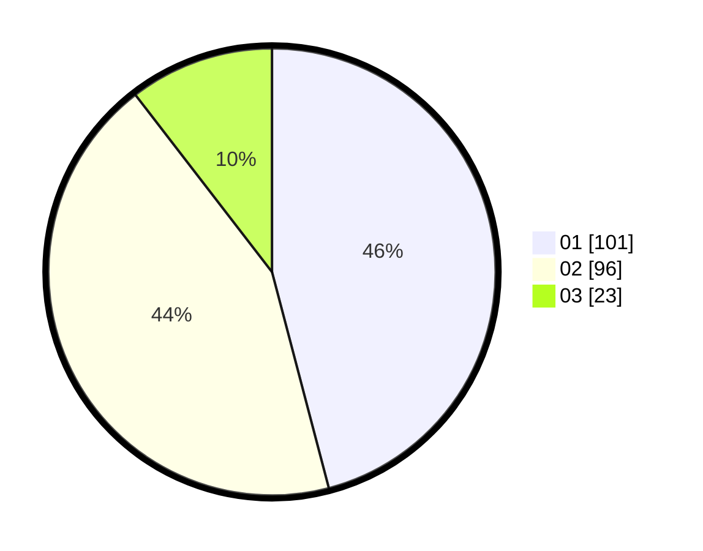

# Hasil

Hasil perolehan suara paslon dapat dilihat pada file paslon-01.txt, paslon-02.txt, dan paslon-03.txt.

Jika tidak ada, artinya data tersebut belum ada pada SIREKAP.

## Perolehan Suara

 * Paslon 01: **101**.
 * Paslon 02: **96**.
 * Paslon 03: **23**.

## Foto C Plano

https://sirekap-obj-formc.kpu.go.id/5af5/pemilu/ppwp/31/74/04/10/05/3174041005090-20240215-000232--9f03f2fc-8281-41cc-8b26-5f17a071f596.jpg

https://sirekap-obj-formc.kpu.go.id/5af5/pemilu/ppwp/31/74/04/10/05/3174041005090-20240215-000308--107975cf-ad0a-4b04-951c-17527cc767fd.jpg

https://sirekap-obj-formc.kpu.go.id/5af5/pemilu/ppwp/31/74/04/10/05/3174041005090-20240215-000338--606e75aa-8ab7-4b53-9aba-4b1dff39e122.jpg

## DATA PEMILIH TETAP

Jumlah pemilih dalam DPT: **245**.
 * L: **723**.
 * P: **122**.

## DATA PENGGUNA HAK PILIH

Jumlah pengguna hak pilih dalam DPT: **208**.
 * L: **100**.
 * P: **108**.

Jumlah pengguna hak pilih dalam DPTb: **814**.
 * L: **7**.
 * P: **80**.

Jumlah pengguna hak pilih dalam DPK: **0**.
 * L: **0**.
 * P: **0**.

Jumlah pengguna hak pilih: **222**.
 * L: **107**.
 * P: **115**.

## JUMLAH SUARA SAH DAN TIDAK SAH

JUMLAH SELURUH SUARA SAH: **220**.

JUMLAH SUARA TIDAK SAH: **2**.

JUMLAH SELURUH SUARA SAH DAN SUARA TIDAK SAH: **222**.
