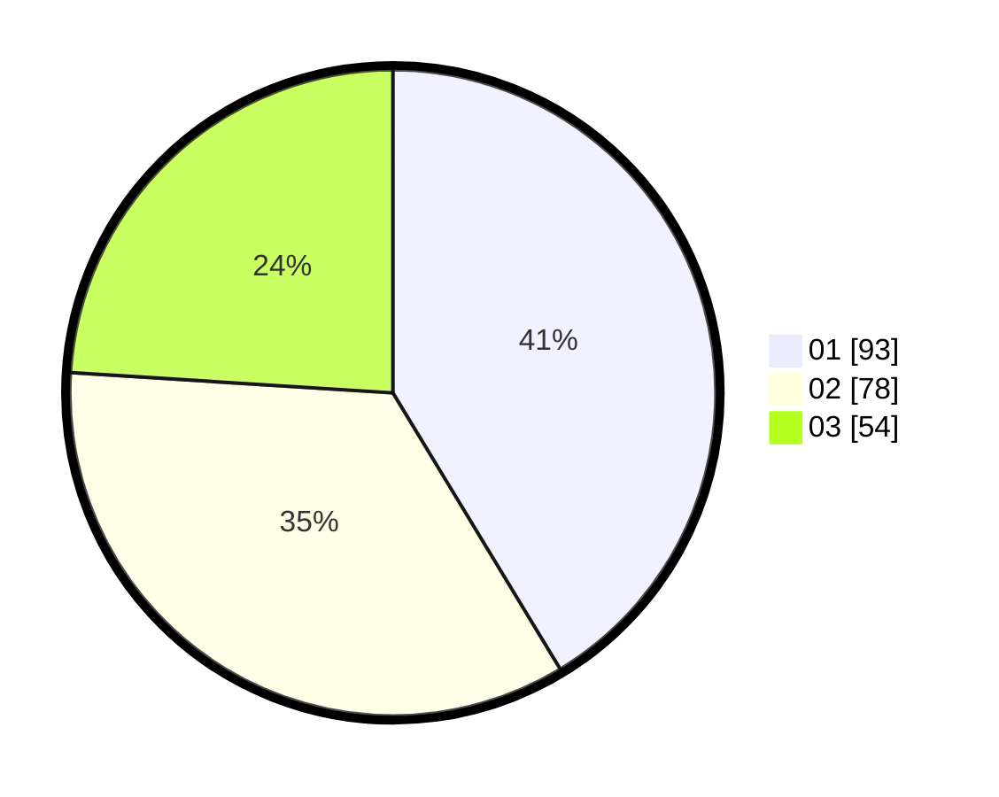

# Hasil

Hasil perolehan suara paslon dapat dilihat pada file paslon-01.txt, paslon-02.txt, dan paslon-03.txt.

Jika tidak ada, artinya data tersebut belum ada pada SIREKAP.

## Perolehan Suara

 * Paslon 01: **93**.
 * Paslon 02: **78**.
 * Paslon 03: **54**.

## Foto C Plano

https://sirekap-obj-formc.kpu.go.id/0d2d/pemilu/ppwp/31/74/04/10/05/3174041005093-20240216-082745--ab520d47-5952-489d-8582-6ad007ec201d.jpg

https://sirekap-obj-formc.kpu.go.id/0d2d/pemilu/ppwp/31/74/04/10/05/3174041005093-20240216-082752--72d36f92-c136-4320-9bfc-58a0d3bae250.jpg

https://sirekap-obj-formc.kpu.go.id/0d2d/pemilu/ppwp/31/74/04/10/05/3174041005093-20240216-082746--4792396b-392b-459a-a6f4-ef3d7f728ef6.jpg

## DATA PEMILIH TETAP

Jumlah pemilih dalam DPT: **266**.
 * L: **137**.
 * P: **129**.

## DATA PENGGUNA HAK PILIH

Jumlah pengguna hak pilih dalam DPT: **226**.
 * L: **116**.
 * P: **110**.

Jumlah pengguna hak pilih dalam DPTb: **1**.
 * L: **1**.
 * P: **0**.

Jumlah pengguna hak pilih dalam DPK: **1**.
 * L: **0**.
 * P: **1**.

Jumlah pengguna hak pilih: **228**.
 * L: **117**.
 * P: **111**.

## JUMLAH SUARA SAH DAN TIDAK SAH

JUMLAH SELURUH SUARA SAH: **225**.

JUMLAH SUARA TIDAK SAH: **3**.

JUMLAH SELURUH SUARA SAH DAN SUARA TIDAK SAH: **228**.
