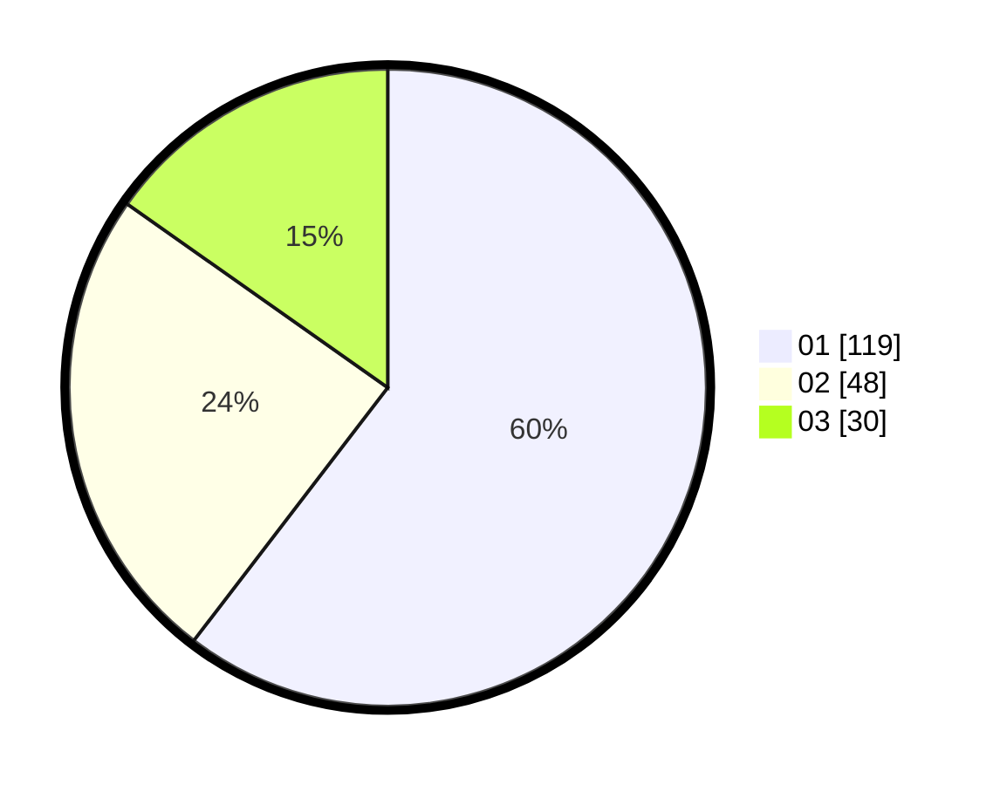

# Hasil

Hasil perolehan suara paslon dapat dilihat pada file paslon-01.txt, paslon-02.txt, dan paslon-03.txt.

Jika tidak ada, artinya data tersebut belum ada pada SIREKAP.

## Perolehan Suara

 * Paslon 01: **119**.
 * Paslon 02: **48**.
 * Paslon 03: **30**.

## Foto C Plano

https://sirekap-obj-formc.kpu.go.id/1953/pemilu/ppwp/31/74/04/10/05/3174041005098-20240214-155506--686f34ae-dca7-4c17-996a-bea7cbce26f2.jpg

https://sirekap-obj-formc.kpu.go.id/1953/pemilu/ppwp/31/74/04/10/05/3174041005098-20240214-155708--4530441f-d1de-43ed-a6b4-0dd076065f88.jpg

https://sirekap-obj-formc.kpu.go.id/1953/pemilu/ppwp/31/74/04/10/05/3174041005098-20240214-155834--8a4b56a2-654b-48bd-9c31-49be10ed7893.jpg

## DATA PEMILIH TETAP

Jumlah pemilih dalam DPT: **262**.
 * L: **131**.
 * P: **131**.

## DATA PENGGUNA HAK PILIH

Jumlah pengguna hak pilih dalam DPT: **201**.
 * L: **97**.
 * P: **104**.

Jumlah pengguna hak pilih dalam DPTb: **2**.
 * L: **2**.
 * P: **0**.

Jumlah pengguna hak pilih dalam DPK: **0**.
 * L: **0**.
 * P: **0**.

Jumlah pengguna hak pilih: **203**.
 * L: **99**.
 * P: **104**.

## JUMLAH SUARA SAH DAN TIDAK SAH

JUMLAH SELURUH SUARA SAH: **197**.

JUMLAH SUARA TIDAK SAH: **6**.

JUMLAH SELURUH SUARA SAH DAN SUARA TIDAK SAH: **203**.
