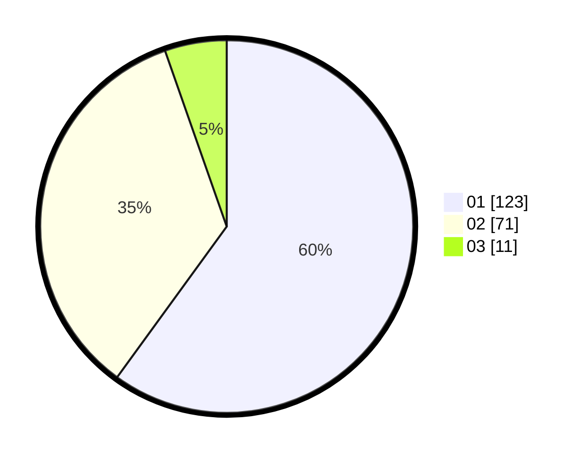

# Hasil

Hasil perolehan suara paslon dapat dilihat pada file paslon-01.txt, paslon-02.txt, dan paslon-03.txt.

Jika tidak ada, artinya data tersebut belum ada pada SIREKAP.

## Perolehan Suara

 * Paslon 01: **123**.
 * Paslon 02: **71**.
 * Paslon 03: **11**.

## Foto C Plano

https://sirekap-obj-formc.kpu.go.id/61fd/pemilu/ppwp/31/74/04/10/05/3174041005123-20240214-230617--b34ab70e-98f8-434c-8f13-c1a20c661d9e.jpg

https://sirekap-obj-formc.kpu.go.id/61fd/pemilu/ppwp/31/74/04/10/05/3174041005123-20240214-155923--bcf2651b-65fb-4765-bf4a-98280561accd.jpg

https://sirekap-obj-formc.kpu.go.id/61fd/pemilu/ppwp/31/74/04/10/05/3174041005123-20240214-160115--9e84cabe-da8f-4947-8011-6776a3e6d707.jpg
