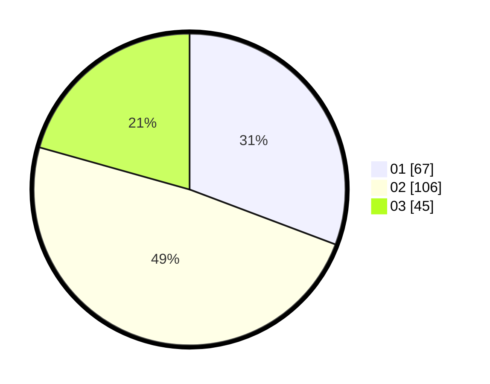

# Hasil

Hasil perolehan suara paslon dapat dilihat pada file paslon-01.txt, paslon-02.txt, dan paslon-03.txt.

Jika tidak ada, artinya data tersebut belum ada pada SIREKAP.

## Perolehan Suara

 * Paslon 01: **67**.
 * Paslon 02: **106**.
 * Paslon 03: **45**.

## Foto C Plano

https://sirekap-obj-formc.kpu.go.id/4dc4/pemilu/ppwp/31/74/04/10/05/3174041005133-20240214-193320--645176f5-db06-4b28-b954-d33675d89304.jpg

https://sirekap-obj-formc.kpu.go.id/4dc4/pemilu/ppwp/31/74/04/10/05/3174041005133-20240214-193325--172238d2-c97b-404a-91ee-62ec13dec4ce.jpg

https://sirekap-obj-formc.kpu.go.id/4dc4/pemilu/ppwp/31/74/04/10/05/3174041005133-20240214-193334--dfa85fb6-a6dc-4b48-8c6c-db698d6a2acc.jpg

## DATA PEMILIH TETAP

Jumlah pemilih dalam DPT: **256**.
 * L: **130**.
 * P: **126**.

## DATA PENGGUNA HAK PILIH

Jumlah pengguna hak pilih dalam DPT: **215**.
 * L: **104**.
 * P: **111**.

Jumlah pengguna hak pilih dalam DPTb: **1**.
 * L: **1**.
 * P: **0**.

Jumlah pengguna hak pilih dalam DPK: **5**.
 * L: **3**.
 * P: **2**.

Jumlah pengguna hak pilih: **221**.
 * L: **108**.
 * P: **113**.

## JUMLAH SUARA SAH DAN TIDAK SAH

JUMLAH SELURUH SUARA SAH: **218**.

JUMLAH SUARA TIDAK SAH: **3**.

JUMLAH SELURUH SUARA SAH DAN SUARA TIDAK SAH: **221**.
