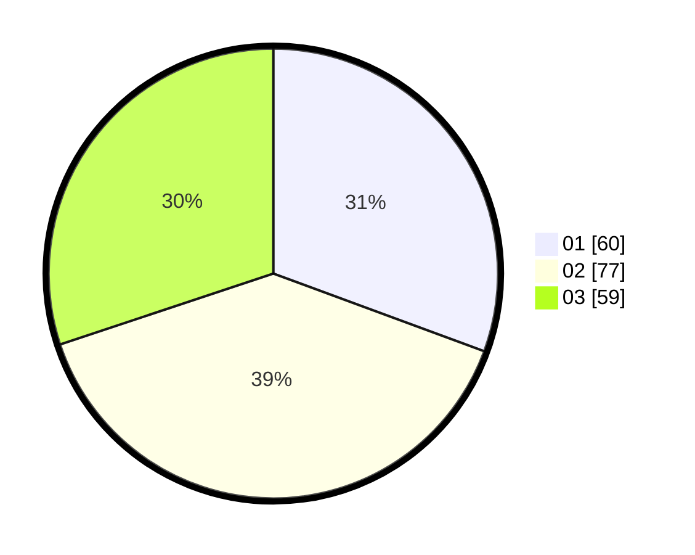

# Hasil

Hasil perolehan suara paslon dapat dilihat pada file paslon-01.txt, paslon-02.txt, dan paslon-03.txt.

Jika tidak ada, artinya data tersebut belum ada pada SIREKAP.

## Perolehan Suara

 * Paslon 01: **60**.
 * Paslon 02: **77**.
 * Paslon 03: **59**.

## Foto C Plano

https://sirekap-obj-formc.kpu.go.id/1d02/pemilu/ppwp/31/74/04/10/05/3174041005135-20240214-215043--2a2be9a7-74f5-4d63-9e87-2866a0358b5b.jpg

https://sirekap-obj-formc.kpu.go.id/1d02/pemilu/ppwp/31/74/04/10/05/3174041005135-20240214-215104--d9e6c383-ddf8-495a-bb83-f688f2686c99.jpg

https://sirekap-obj-formc.kpu.go.id/1d02/pemilu/ppwp/31/74/04/10/05/3174041005135-20240214-215053--68c004c0-0b68-441e-895e-f49632178d06.jpg

## DATA PEMILIH TETAP

Jumlah pemilih dalam DPT: **256**.
 * L: **129**.
 * P: **127**.

## DATA PENGGUNA HAK PILIH

Jumlah pengguna hak pilih dalam DPT: **198**.
 * L: **105**.
 * P: **93**.

Jumlah pengguna hak pilih dalam DPTb: **0**.
 * L: **0**.
 * P: **0**.

Jumlah pengguna hak pilih dalam DPK: **0**.
 * L: **0**.
 * P: **0**.

Jumlah pengguna hak pilih: **198**.
 * L: **105**.
 * P: **93**.

## JUMLAH SUARA SAH DAN TIDAK SAH

JUMLAH SELURUH SUARA SAH: **196**.

JUMLAH SUARA TIDAK SAH: **2**.

JUMLAH SELURUH SUARA SAH DAN SUARA TIDAK SAH: **198**.
