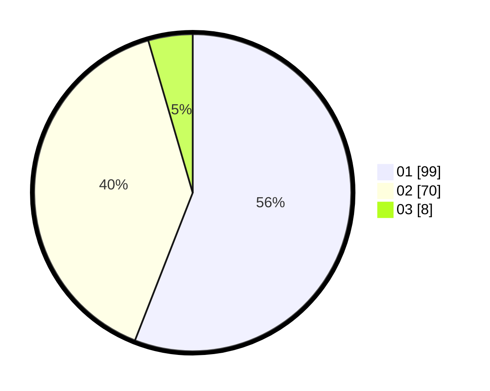

# Hasil

Hasil perolehan suara paslon dapat dilihat pada file paslon-01.txt, paslon-02.txt, dan paslon-03.txt.

Jika tidak ada, artinya data tersebut belum ada pada SIREKAP.

## Perolehan Suara

 * Paslon 01: **99**.
 * Paslon 02: **70**.
 * Paslon 03: **8**.

## Foto C Plano

https://sirekap-obj-formc.kpu.go.id/4367/pemilu/ppwp/31/74/04/10/05/3174041005157-20240214-155552--8c4af287-a50b-431c-ad4a-c82ab1e853e4.jpg

https://sirekap-obj-formc.kpu.go.id/4367/pemilu/ppwp/31/74/04/10/05/3174041005157-20240214-155641--6027148f-abed-435a-ba14-6d37c77c784f.jpg

https://sirekap-obj-formc.kpu.go.id/4367/pemilu/ppwp/31/74/04/10/05/3174041005157-20240214-155722--b66d887e-029a-4a66-b875-a6adee43fb18.jpg

## DATA PEMILIH TETAP

Jumlah pemilih dalam DPT: **244**.
 * L: **127**.
 * P: **117**.

## DATA PENGGUNA HAK PILIH

Jumlah pengguna hak pilih dalam DPT: **173**.
 * L: **88**.
 * P: **85**.

Jumlah pengguna hak pilih dalam DPTb: **3**.
 * L: **1**.
 * P: **2**.

Jumlah pengguna hak pilih dalam DPK: **1**.
 * L: **0**.
 * P: **1**.

Jumlah pengguna hak pilih: **177**.
 * L: **0**.
 * P: **0**.

## JUMLAH SUARA SAH DAN TIDAK SAH

JUMLAH SELURUH SUARA SAH: **177**.

JUMLAH SUARA TIDAK SAH: **0**.

JUMLAH SELURUH SUARA SAH DAN SUARA TIDAK SAH: **177**.
