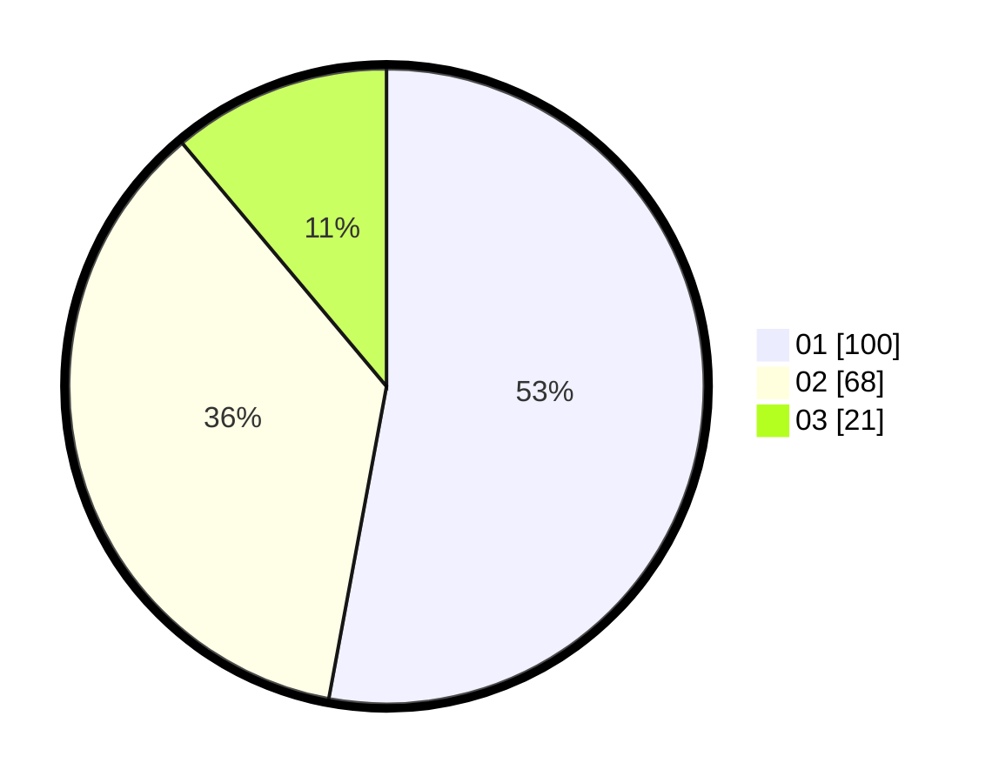

# Hasil

Hasil perolehan suara paslon dapat dilihat pada file paslon-01.txt, paslon-02.txt, dan paslon-03.txt.

Jika tidak ada, artinya data tersebut belum ada pada SIREKAP.

## Perolehan Suara

 * Paslon 01: **100**.
 * Paslon 02: **68**.
 * Paslon 03: **21**.

## Foto C Plano

https://sirekap-obj-formc.kpu.go.id/09bf/pemilu/ppwp/31/74/04/10/05/3174041005194-20240214-201124--2a9e08ef-e982-4015-bbac-8cac67de5962.jpg

https://sirekap-obj-formc.kpu.go.id/09bf/pemilu/ppwp/31/74/04/10/05/3174041005194-20240214-201157--0f31a04c-73f9-4c55-8473-4bcd39ee0f53.jpg

https://sirekap-obj-formc.kpu.go.id/09bf/pemilu/ppwp/31/74/04/10/05/3174041005194-20240214-201354--7c5770a3-af70-4991-aa70-5f45d75d1314.jpg

## DATA PEMILIH TETAP

Jumlah pemilih dalam DPT: **262**.
 * L: **123**.
 * P: **139**.

## DATA PENGGUNA HAK PILIH

Jumlah pengguna hak pilih dalam DPT: **189**.
 * L: **82**.
 * P: **107**.

Jumlah pengguna hak pilih dalam DPTb: **1**.
 * L: **0**.
 * P: **1**.

Jumlah pengguna hak pilih dalam DPK: **2**.
 * L: **0**.
 * P: **2**.

Jumlah pengguna hak pilih: **192**.
 * L: **82**.
 * P: **110**.

## JUMLAH SUARA SAH DAN TIDAK SAH

JUMLAH SELURUH SUARA SAH: **189**.

JUMLAH SUARA TIDAK SAH: **3**.

JUMLAH SELURUH SUARA SAH DAN SUARA TIDAK SAH: **192**.
