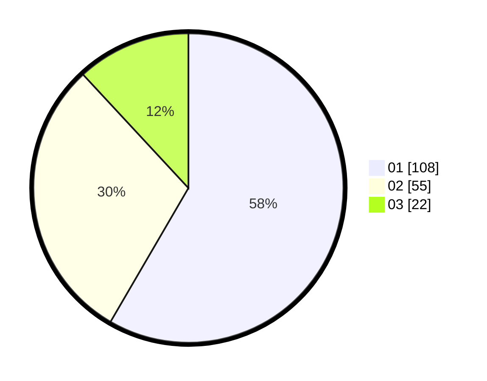

# Hasil

Hasil perolehan suara paslon dapat dilihat pada file paslon-01.txt, paslon-02.txt, dan paslon-03.txt.

Jika tidak ada, artinya data tersebut belum ada pada SIREKAP.

## Perolehan Suara

 * Paslon 01: **108**.
 * Paslon 02: **55**.
 * Paslon 03: **22**.

## Foto C Plano

https://sirekap-obj-formc.kpu.go.id/3f0b/pemilu/ppwp/31/74/04/10/06/3174041006003-20240214-220632--7fe20816-7033-41ef-99b1-0f5de445fae9.jpg

https://sirekap-obj-formc.kpu.go.id/3f0b/pemilu/ppwp/31/74/04/10/06/3174041006003-20240214-203215--96d86501-19ff-402d-b311-54114246a735.jpg

https://sirekap-obj-formc.kpu.go.id/3f0b/pemilu/ppwp/31/74/04/10/06/3174041006003-20240214-194725--5f8032b4-cbea-4271-9023-31f857349f79.jpg
