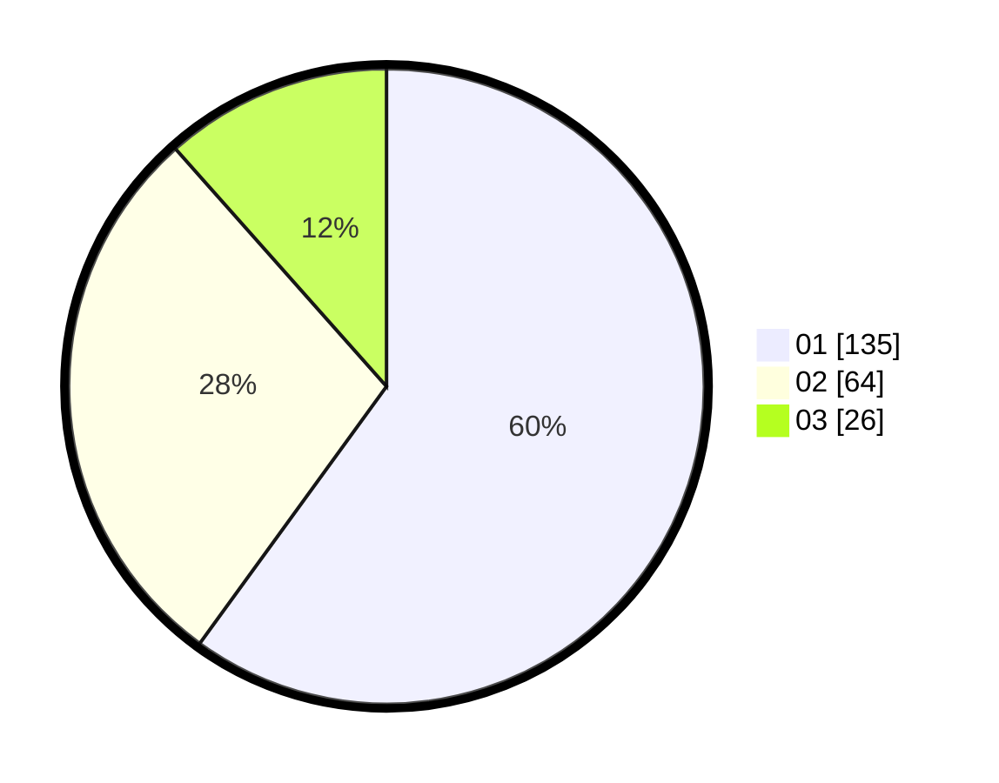

# Hasil

Hasil perolehan suara paslon dapat dilihat pada file paslon-01.txt, paslon-02.txt, dan paslon-03.txt.

Jika tidak ada, artinya data tersebut belum ada pada SIREKAP.

## Perolehan Suara

 * Paslon 01: **135**.
 * Paslon 02: **64**.
 * Paslon 03: **26**.

## Foto C Plano

https://sirekap-obj-formc.kpu.go.id/cd89/pemilu/ppwp/31/74/04/10/06/3174041006004-20240214-193506--65694b8d-fac4-49ec-8edd-32e14ff78096.jpg

https://sirekap-obj-formc.kpu.go.id/cd89/pemilu/ppwp/31/74/04/10/06/3174041006004-20240214-184417--739fb3bd-344c-41b8-9a08-4de5cd19c643.jpg

https://sirekap-obj-formc.kpu.go.id/cd89/pemilu/ppwp/31/74/04/10/06/3174041006004-20240214-184455--0c23b522-9605-4deb-b71a-706516bf844b.jpg

## DATA PEMILIH TETAP

Jumlah pemilih dalam DPT: **268**.
 * L: **127**.
 * P: **141**.

## DATA PENGGUNA HAK PILIH

Jumlah pengguna hak pilih dalam DPT: **222**.
 * L: **102**.
 * P: **120**.

Jumlah pengguna hak pilih dalam DPTb: **3**.
 * L: **2**.
 * P: **1**.

Jumlah pengguna hak pilih dalam DPK: **2**.
 * L: **1**.
 * P: **1**.

Jumlah pengguna hak pilih: **227**.
 * L: **105**.
 * P: **122**.

## JUMLAH SUARA SAH DAN TIDAK SAH

JUMLAH SELURUH SUARA SAH: **225**.

JUMLAH SUARA TIDAK SAH: **2**.

JUMLAH SELURUH SUARA SAH DAN SUARA TIDAK SAH: **227**.
