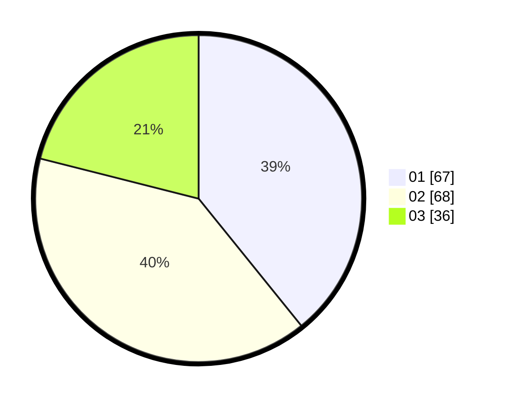

# Hasil

Hasil perolehan suara paslon dapat dilihat pada file paslon-01.txt, paslon-02.txt, dan paslon-03.txt.

Jika tidak ada, artinya data tersebut belum ada pada SIREKAP.

## Perolehan Suara

 * Paslon 01: **67**.
 * Paslon 02: **68**.
 * Paslon 03: **36**.

## Foto C Plano

https://sirekap-obj-formc.kpu.go.id/8259/pemilu/ppwp/31/74/04/10/06/3174041006007-20240216-184311--80f69282-5583-4a4a-bb4a-d43516a3312c.jpg

https://sirekap-obj-formc.kpu.go.id/8259/pemilu/ppwp/31/74/04/10/06/3174041006007-20240215-130951--9cf3745c-8ed1-4bf2-9529-ca63c3819790.jpg

https://sirekap-obj-formc.kpu.go.id/8259/pemilu/ppwp/31/74/04/10/06/3174041006007-20240215-132343--8f55de99-4151-4f0d-8b66-a4ee34e81b99.jpg
