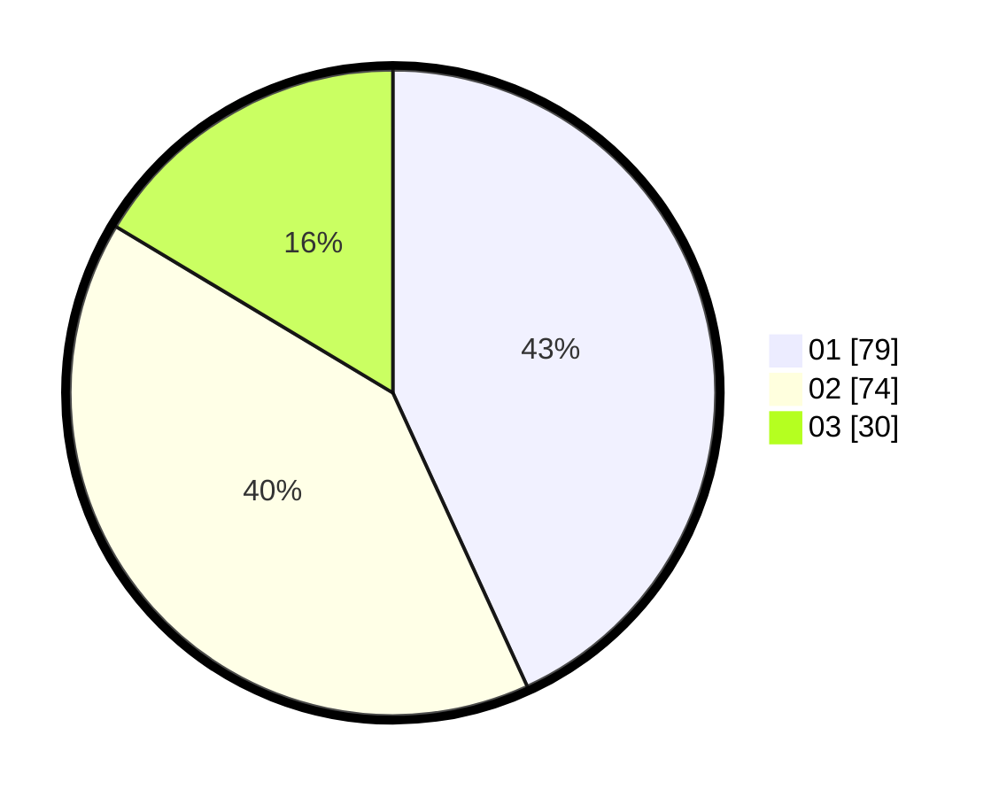

# Hasil

Hasil perolehan suara paslon dapat dilihat pada file paslon-01.txt, paslon-02.txt, dan paslon-03.txt.

Jika tidak ada, artinya data tersebut belum ada pada SIREKAP.

## Perolehan Suara

 * Paslon 01: **79**.
 * Paslon 02: **74**.
 * Paslon 03: **30**.

## Foto C Plano

https://sirekap-obj-formc.kpu.go.id/c4a9/pemilu/ppwp/31/74/04/10/06/3174041006022-20240214-191036--c6e03067-1de3-4394-88e6-758de2cd1450.jpg

https://sirekap-obj-formc.kpu.go.id/c4a9/pemilu/ppwp/31/74/04/10/06/3174041006022-20240214-185736--a79e355d-90a0-4c17-887f-ec876f4b4c55.jpg

https://sirekap-obj-formc.kpu.go.id/c4a9/pemilu/ppwp/31/74/04/10/06/3174041006022-20240214-191745--5785cd14-e2f6-4f18-815f-3b2b87e8c247.jpg

## DATA PEMILIH TETAP

Jumlah pemilih dalam DPT: **252**.
 * L: **115**.
 * P: **137**.

## DATA PENGGUNA HAK PILIH

Jumlah pengguna hak pilih dalam DPT: **176**.
 * L: **75**.
 * P: **101**.

Jumlah pengguna hak pilih dalam DPTb: **6**.
 * L: **1**.
 * P: **5**.

Jumlah pengguna hak pilih dalam DPK: **4**.
 * L: **2**.
 * P: **2**.

Jumlah pengguna hak pilih: **186**.
 * L: **78**.
 * P: **108**.

## JUMLAH SUARA SAH DAN TIDAK SAH

JUMLAH SELURUH SUARA SAH: **183**.

JUMLAH SUARA TIDAK SAH: **3**.

JUMLAH SELURUH SUARA SAH DAN SUARA TIDAK SAH: **186**.
