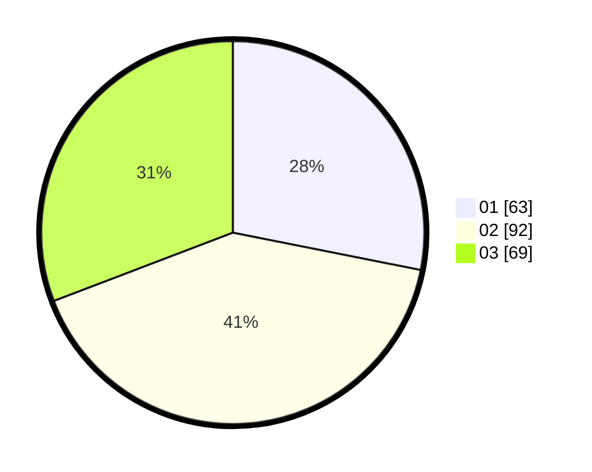

# Hasil

Hasil perolehan suara paslon dapat dilihat pada file paslon-01.txt, paslon-02.txt, dan paslon-03.txt.

Jika tidak ada, artinya data tersebut belum ada pada SIREKAP.

## Perolehan Suara

 * Paslon 01: **63**.
 * Paslon 02: **92**.
 * Paslon 03: **69**.

## Foto C Plano

https://sirekap-obj-formc.kpu.go.id/65df/pemilu/ppwp/31/74/04/10/06/3174041006026-20240214-185027--3c2e47e1-b04d-4ba0-9894-cb55ee9cfa40.jpg

https://sirekap-obj-formc.kpu.go.id/65df/pemilu/ppwp/31/74/04/10/06/3174041006026-20240214-185037--a4a590fc-46a4-46e2-9b32-b6161b6219bb.jpg

https://sirekap-obj-formc.kpu.go.id/65df/pemilu/ppwp/31/74/04/10/06/3174041006026-20240214-185044--5112ab81-489f-49d1-9e7b-91e6939b77ea.jpg

## DATA PEMILIH TETAP

Jumlah pemilih dalam DPT: **268**.
 * L: **120**.
 * P: **148**.

## DATA PENGGUNA HAK PILIH

Jumlah pengguna hak pilih dalam DPT: **217**.
 * L: **89**.
 * P: **128**.

Jumlah pengguna hak pilih dalam DPTb: **8**.
 * L: **2**.
 * P: **6**.

Jumlah pengguna hak pilih dalam DPK: **1**.
 * L: **1**.
 * P: **0**.

Jumlah pengguna hak pilih: **226**.
 * L: **92**.
 * P: **134**.

## JUMLAH SUARA SAH DAN TIDAK SAH

JUMLAH SELURUH SUARA SAH: **224**.

JUMLAH SUARA TIDAK SAH: **2**.

JUMLAH SELURUH SUARA SAH DAN SUARA TIDAK SAH: **226**.
