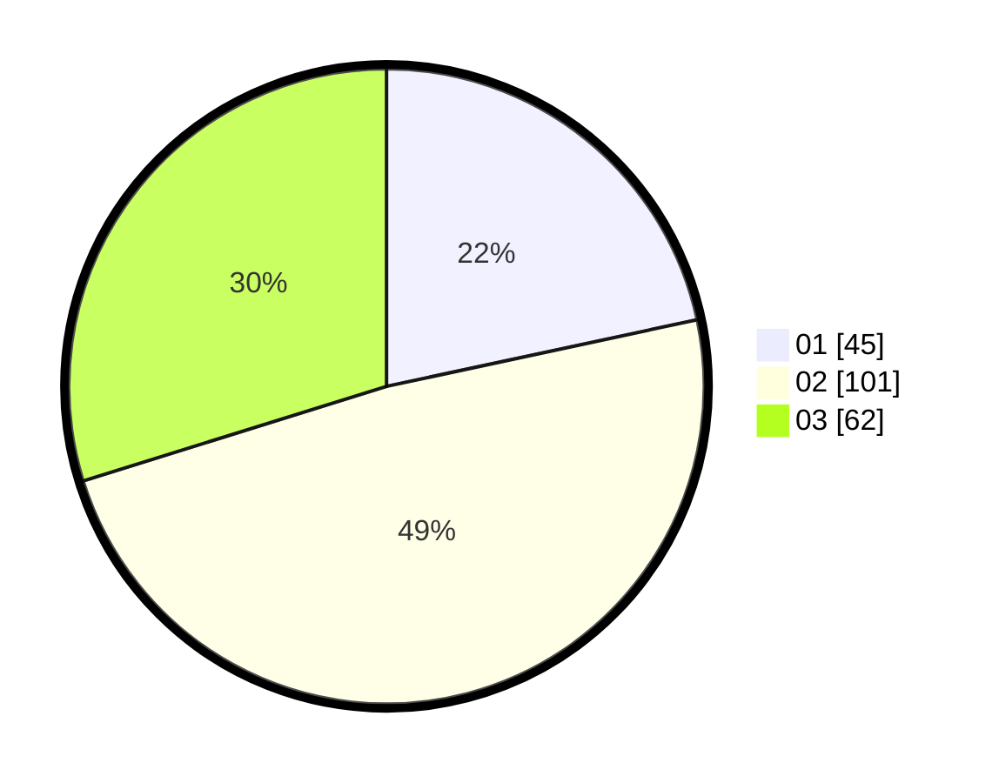

# Hasil

Hasil perolehan suara paslon dapat dilihat pada file paslon-01.txt, paslon-02.txt, dan paslon-03.txt.

Jika tidak ada, artinya data tersebut belum ada pada SIREKAP.

## Perolehan Suara

 * Paslon 01: **45**.
 * Paslon 02: **101**.
 * Paslon 03: **62**.

## Foto C Plano

https://sirekap-obj-formc.kpu.go.id/df94/pemilu/ppwp/31/74/04/10/06/3174041006027-20240214-195430--3e18f8c5-270e-477d-a3d5-5fb077002b87.jpg

https://sirekap-obj-formc.kpu.go.id/df94/pemilu/ppwp/31/74/04/10/06/3174041006027-20240214-195436--dd384c5e-6741-4bf0-81a8-c147195c86ca.jpg

https://sirekap-obj-formc.kpu.go.id/df94/pemilu/ppwp/31/74/04/10/06/3174041006027-20240214-195402--ff5d79fd-e321-408b-8662-367cdff96d2b.jpg

## DATA PEMILIH TETAP

Jumlah pemilih dalam DPT: **260**.
 * L: **108**.
 * P: **152**.

## DATA PENGGUNA HAK PILIH

Jumlah pengguna hak pilih dalam DPT: **202**.
 * L: **80**.
 * P: **122**.

Jumlah pengguna hak pilih dalam DPTb: **2**.
 * L: **1**.
 * P: **1**.

Jumlah pengguna hak pilih dalam DPK: **6**.
 * L: **3**.
 * P: **3**.

Jumlah pengguna hak pilih: **210**.
 * L: **84**.
 * P: **126**.

## JUMLAH SUARA SAH DAN TIDAK SAH

JUMLAH SELURUH SUARA SAH: **208**.

JUMLAH SUARA TIDAK SAH: **2**.

JUMLAH SELURUH SUARA SAH DAN SUARA TIDAK SAH: **210**.
