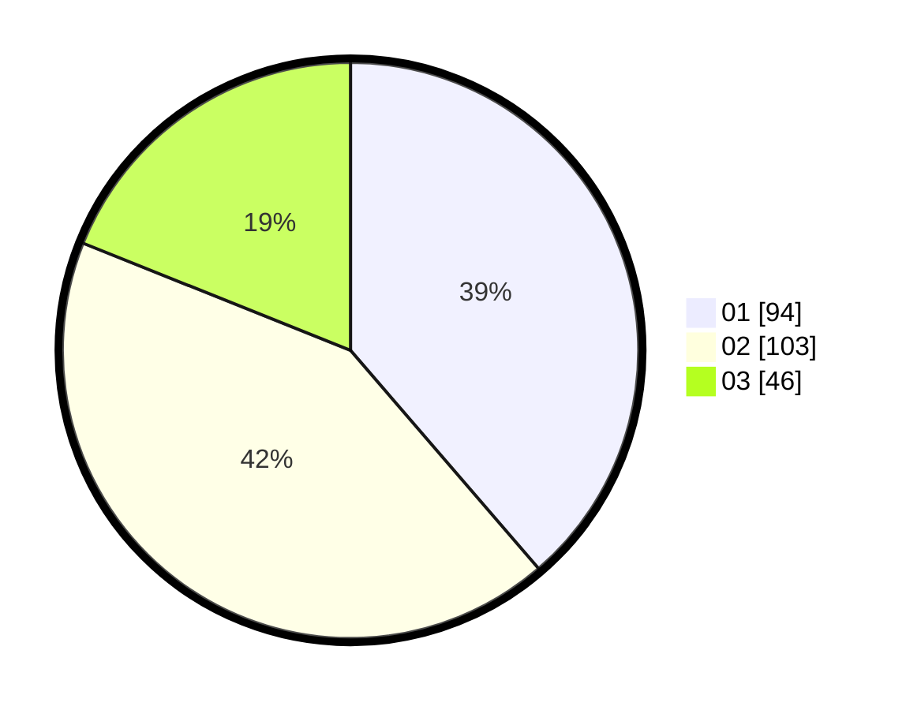

# Hasil

Hasil perolehan suara paslon dapat dilihat pada file paslon-01.txt, paslon-02.txt, dan paslon-03.txt.

Jika tidak ada, artinya data tersebut belum ada pada SIREKAP.

## Perolehan Suara

 * Paslon 01: **94**.
 * Paslon 02: **103**.
 * Paslon 03: **46**.

## Foto C Plano

https://sirekap-obj-formc.kpu.go.id/dfc0/pemilu/ppwp/31/74/04/10/06/3174041006029-20240215-013130--8dcc6953-58a3-4e28-b771-bc855855a04f.jpg

https://sirekap-obj-formc.kpu.go.id/dfc0/pemilu/ppwp/31/74/04/10/06/3174041006029-20240214-193929--2db1c507-66cb-4510-9051-a62e82f1c857.jpg

https://sirekap-obj-formc.kpu.go.id/dfc0/pemilu/ppwp/31/74/04/10/06/3174041006029-20240215-013229--d8f2f8ca-6f79-4f61-a4cc-fe6730b992e9.jpg

## DATA PEMILIH TETAP

Jumlah pemilih dalam DPT: **265**.
 * L: **113**.
 * P: **152**.

## DATA PENGGUNA HAK PILIH

Jumlah pengguna hak pilih dalam DPT: **223**.
 * L: **94**.
 * P: **129**.

Jumlah pengguna hak pilih dalam DPTb: **2**.
 * L: **0**.
 * P: **2**.

Jumlah pengguna hak pilih dalam DPK: **18**.
 * L: **10**.
 * P: **8**.

Jumlah pengguna hak pilih: **243**.
 * L: **104**.
 * P: **139**.

## JUMLAH SUARA SAH DAN TIDAK SAH

JUMLAH SELURUH SUARA SAH: **243**.

JUMLAH SUARA TIDAK SAH: **0**.

JUMLAH SELURUH SUARA SAH DAN SUARA TIDAK SAH: **243**.
