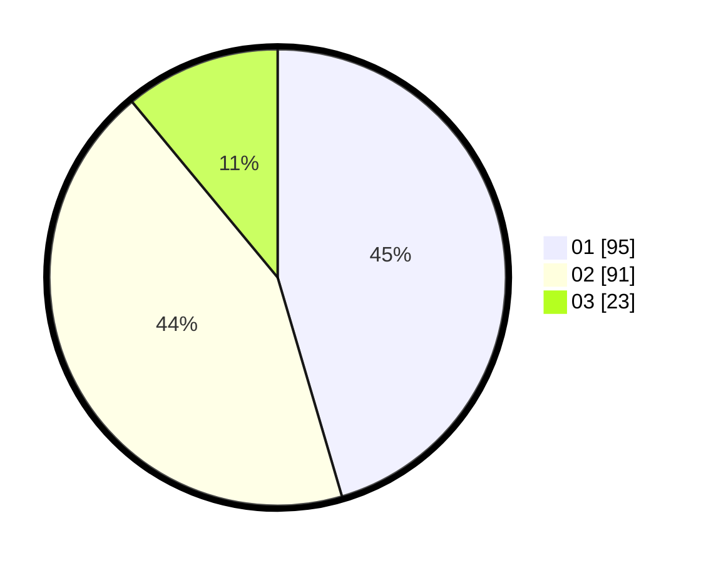

# Hasil

Hasil perolehan suara paslon dapat dilihat pada file paslon-01.txt, paslon-02.txt, dan paslon-03.txt.

Jika tidak ada, artinya data tersebut belum ada pada SIREKAP.

## Perolehan Suara

 * Paslon 01: **95**.
 * Paslon 02: **91**.
 * Paslon 03: **23**.

## Foto C Plano

https://sirekap-obj-formc.kpu.go.id/a3d7/pemilu/ppwp/31/74/04/10/06/3174041006031-20240214-215823--37626079-efbd-4ecf-b169-a65d52cd0f02.jpg

https://sirekap-obj-formc.kpu.go.id/a3d7/pemilu/ppwp/31/74/04/10/06/3174041006031-20240214-220252--f99a8070-c2f1-4f93-b531-ebca053e33b2.jpg

https://sirekap-obj-formc.kpu.go.id/a3d7/pemilu/ppwp/31/74/04/10/06/3174041006031-20240214-220404--2679f072-dbdf-43c8-a596-2001f20536da.jpg
