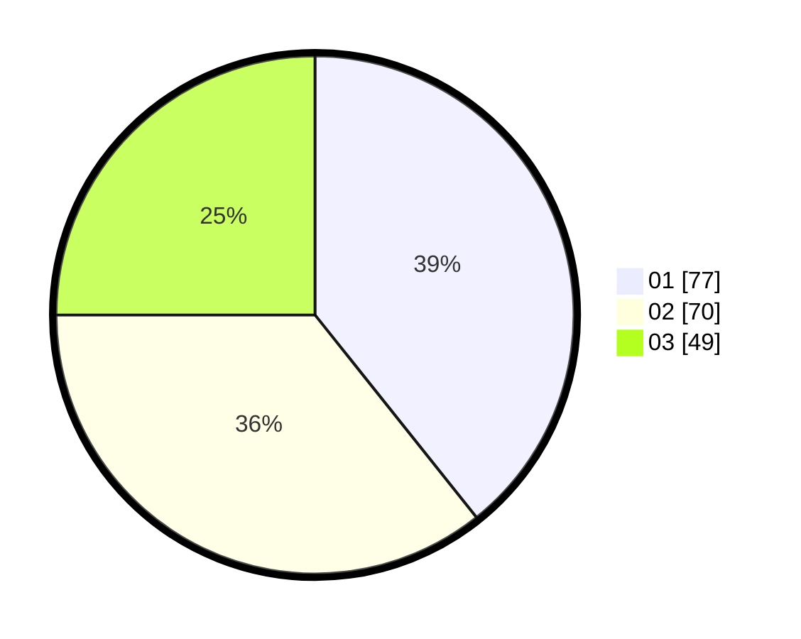

# Hasil

Hasil perolehan suara paslon dapat dilihat pada file paslon-01.txt, paslon-02.txt, dan paslon-03.txt.

Jika tidak ada, artinya data tersebut belum ada pada SIREKAP.

## Perolehan Suara

 * Paslon 01: **77**.
 * Paslon 02: **70**.
 * Paslon 03: **49**.

## Foto C Plano

https://sirekap-obj-formc.kpu.go.id/4d89/pemilu/ppwp/31/74/04/10/06/3174041006035-20240216-225414--42448e55-72b4-4c09-836a-67e664d198b2.jpg

https://sirekap-obj-formc.kpu.go.id/4d89/pemilu/ppwp/31/74/04/10/06/3174041006035-20240215-002126--ea18c4e7-8267-4bf9-a0e0-77c8f97be937.jpg

https://sirekap-obj-formc.kpu.go.id/4d89/pemilu/ppwp/31/74/04/10/06/3174041006035-20240216-225634--f8a2362e-619b-4c39-9c21-2320c428017a.jpg

## DATA PEMILIH TETAP

Jumlah pemilih dalam DPT: **219**.
 * L: **100**.
 * P: **119**.

## DATA PENGGUNA HAK PILIH

Jumlah pengguna hak pilih dalam DPT: **198**.
 * L: **87**.
 * P: **111**.

Jumlah pengguna hak pilih dalam DPTb: **0**.
 * L: **0**.
 * P: **0**.

Jumlah pengguna hak pilih dalam DPK: **2**.
 * L: **2**.
 * P: **0**.

Jumlah pengguna hak pilih: **200**.
 * L: **89**.
 * P: **111**.

## JUMLAH SUARA SAH DAN TIDAK SAH

JUMLAH SELURUH SUARA SAH: **196**.

JUMLAH SUARA TIDAK SAH: **4**.

JUMLAH SELURUH SUARA SAH DAN SUARA TIDAK SAH: **200**.
