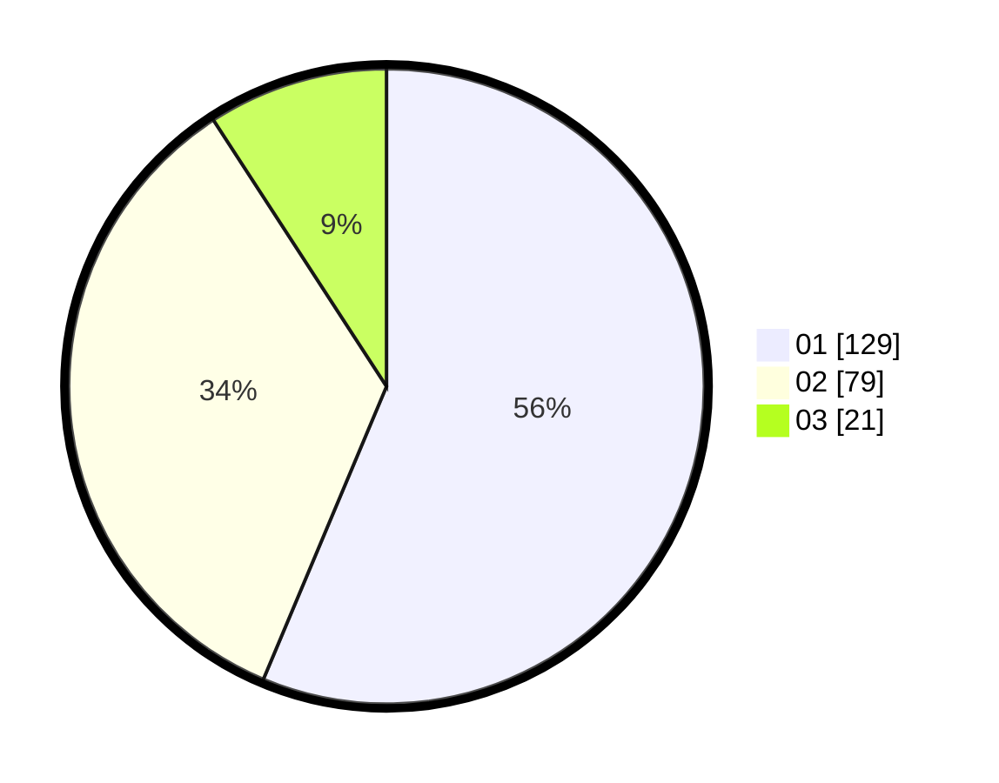

# Hasil

Hasil perolehan suara paslon dapat dilihat pada file paslon-01.txt, paslon-02.txt, dan paslon-03.txt.

Jika tidak ada, artinya data tersebut belum ada pada SIREKAP.

## Perolehan Suara

 * Paslon 01: **129**.
 * Paslon 02: **79**.
 * Paslon 03: **21**.

## Foto C Plano

https://sirekap-obj-formc.kpu.go.id/1977/pemilu/ppwp/31/74/04/10/06/3174041006036-20240214-190058--c28149db-ef28-46bf-8627-8f7af75123b3.jpg

https://sirekap-obj-formc.kpu.go.id/1977/pemilu/ppwp/31/74/04/10/06/3174041006036-20240214-155038--ba23d90a-442e-41aa-8450-37a0ed483b50.jpg

https://sirekap-obj-formc.kpu.go.id/1977/pemilu/ppwp/31/74/04/10/06/3174041006036-20240214-190107--ef435f51-42d4-4257-b0f0-612c83ac0027.jpg

## DATA PEMILIH TETAP

Jumlah pemilih dalam DPT: **284**.
 * L: **148**.
 * P: **136**.

## DATA PENGGUNA HAK PILIH

Jumlah pengguna hak pilih dalam DPT: **229**.
 * L: **119**.
 * P: **110**.

Jumlah pengguna hak pilih dalam DPTb: **0**.
 * L: **0**.
 * P: **0**.

Jumlah pengguna hak pilih dalam DPK: **3**.
 * L: **0**.
 * P: **3**.

Jumlah pengguna hak pilih: **232**.
 * L: **119**.
 * P: **113**.

## JUMLAH SUARA SAH DAN TIDAK SAH

JUMLAH SELURUH SUARA SAH: **229**.

JUMLAH SUARA TIDAK SAH: **3**.

JUMLAH SELURUH SUARA SAH DAN SUARA TIDAK SAH: **232**.
