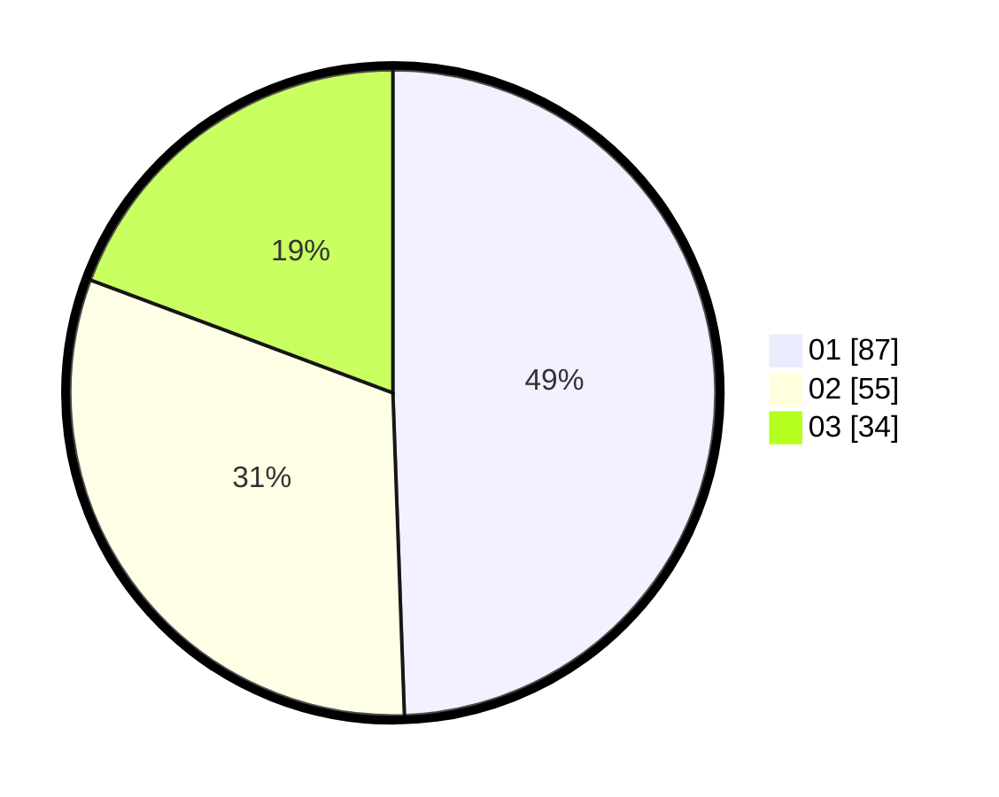

# Hasil

Hasil perolehan suara paslon dapat dilihat pada file paslon-01.txt, paslon-02.txt, dan paslon-03.txt.

Jika tidak ada, artinya data tersebut belum ada pada SIREKAP.

## Perolehan Suara

 * Paslon 01: **87**.
 * Paslon 02: **55**.
 * Paslon 03: **34**.

## Foto C Plano

https://sirekap-obj-formc.kpu.go.id/d686/pemilu/ppwp/31/74/04/10/06/3174041006037-20240216-073519--61057fb7-850c-4011-afb0-f0a0ac3f1a51.jpg

https://sirekap-obj-formc.kpu.go.id/d686/pemilu/ppwp/31/74/04/10/06/3174041006037-20240216-073520--ba357928-c9cf-4ac1-bee4-21b6b6e746b9.jpg

https://sirekap-obj-formc.kpu.go.id/d686/pemilu/ppwp/31/74/04/10/06/3174041006037-20240216-073519--4c0da5cd-9d62-4f2f-aedf-6e66d517755e.jpg

## DATA PEMILIH TETAP

Jumlah pemilih dalam DPT: **244**.
 * L: **112**.
 * P: **132**.

## DATA PENGGUNA HAK PILIH

Jumlah pengguna hak pilih dalam DPT: **180**.
 * L: **76**.
 * P: **104**.

Jumlah pengguna hak pilih dalam DPTb: **2**.
 * L: **1**.
 * P: **1**.

Jumlah pengguna hak pilih dalam DPK: **1**.
 * L: **1**.
 * P: **0**.

Jumlah pengguna hak pilih: **183**.
 * L: **78**.
 * P: **105**.

## JUMLAH SUARA SAH DAN TIDAK SAH

JUMLAH SELURUH SUARA SAH: **176**.

JUMLAH SUARA TIDAK SAH: **7**.

JUMLAH SELURUH SUARA SAH DAN SUARA TIDAK SAH: **183**.
