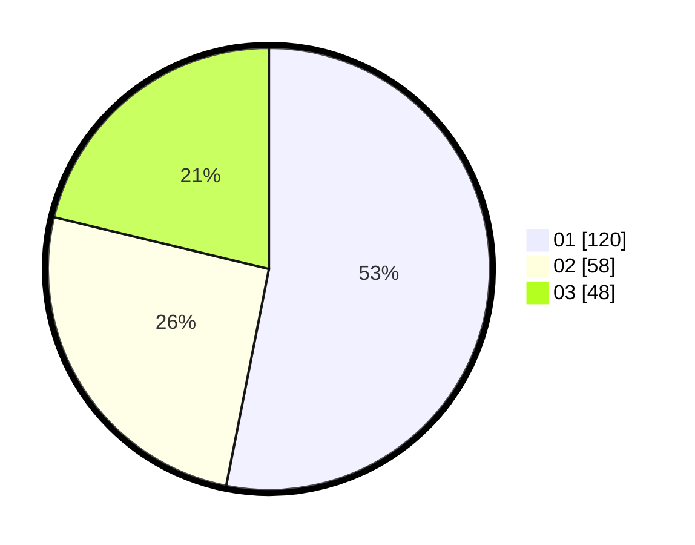

# Hasil

Hasil perolehan suara paslon dapat dilihat pada file paslon-01.txt, paslon-02.txt, dan paslon-03.txt.

Jika tidak ada, artinya data tersebut belum ada pada SIREKAP.

## Perolehan Suara

 * Paslon 01: **120**.
 * Paslon 02: **58**.
 * Paslon 03: **48**.

## Foto C Plano

https://sirekap-obj-formc.kpu.go.id/206f/pemilu/ppwp/31/74/04/10/06/3174041006040-20240214-214918--fafc5e53-1236-432b-b2d2-874dbe05919c.jpg

https://sirekap-obj-formc.kpu.go.id/206f/pemilu/ppwp/31/74/04/10/06/3174041006040-20240214-204003--8d64d0bf-8677-42f6-b238-e13a743676e8.jpg

https://sirekap-obj-formc.kpu.go.id/206f/pemilu/ppwp/31/74/04/10/06/3174041006040-20240214-204123--8b019c5d-ce66-48b2-940f-854a8ecc8757.jpg
