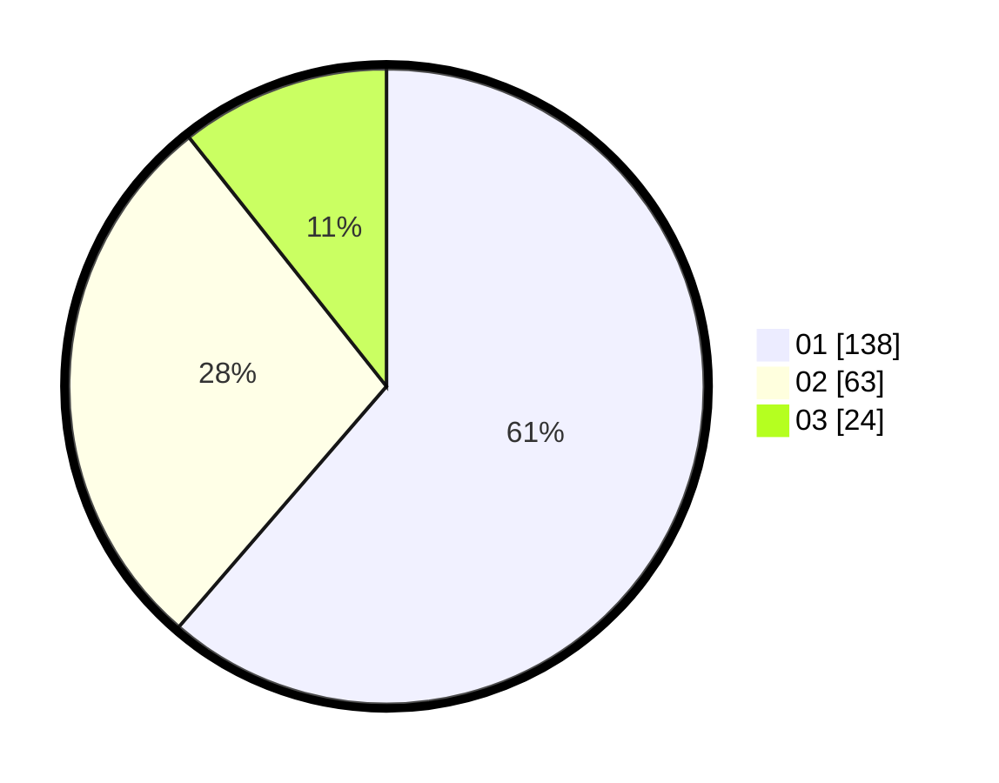

# Hasil

Hasil perolehan suara paslon dapat dilihat pada file paslon-01.txt, paslon-02.txt, dan paslon-03.txt.

Jika tidak ada, artinya data tersebut belum ada pada SIREKAP.

## Perolehan Suara

 * Paslon 01: **138**.
 * Paslon 02: **63**.
 * Paslon 03: **24**.

## Foto C Plano

https://sirekap-obj-formc.kpu.go.id/f3d3/pemilu/ppwp/31/74/04/10/06/3174041006044-20240214-222758--118359be-66e0-4189-9fab-f433b8ae581a.jpg

https://sirekap-obj-formc.kpu.go.id/f3d3/pemilu/ppwp/31/74/04/10/06/3174041006044-20240214-210306--bc1fa761-58a0-47b9-8a2a-006eb120e7f2.jpg

https://sirekap-obj-formc.kpu.go.id/f3d3/pemilu/ppwp/31/74/04/10/06/3174041006044-20240214-202554--68305a26-4f89-422a-aeb3-eedb3464f7cb.jpg
