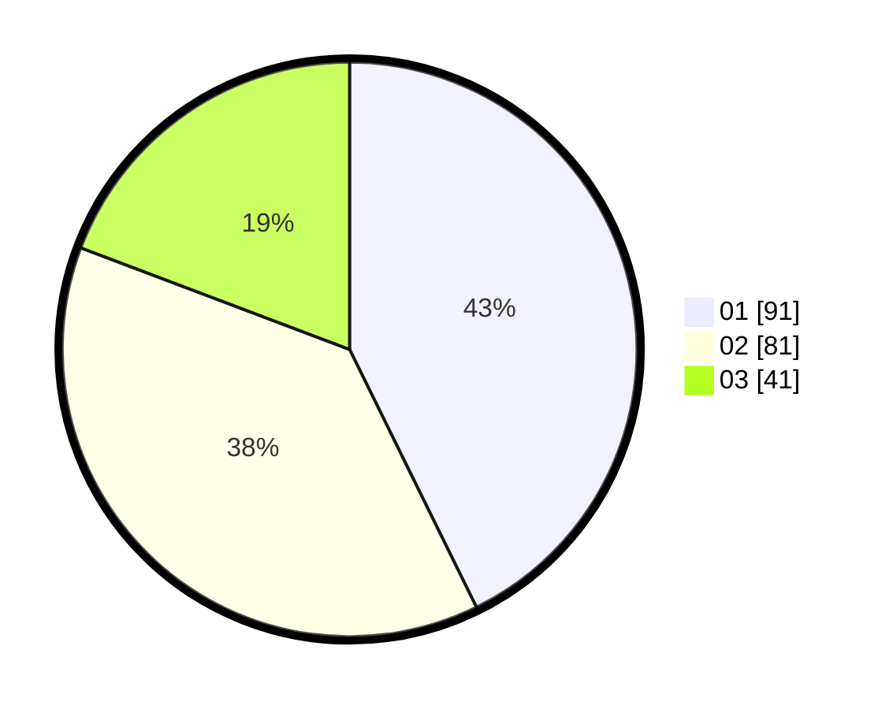

# Hasil

Hasil perolehan suara paslon dapat dilihat pada file paslon-01.txt, paslon-02.txt, dan paslon-03.txt.

Jika tidak ada, artinya data tersebut belum ada pada SIREKAP.

## Perolehan Suara

 * Paslon 01: **91**.
 * Paslon 02: **81**.
 * Paslon 03: **41**.

## Foto C Plano

https://sirekap-obj-formc.kpu.go.id/4d0e/pemilu/ppwp/31/74/04/10/06/3174041006064-20240214-155904--b4c3d2ae-71a2-47fc-affe-71fc609bd43c.jpg

https://sirekap-obj-formc.kpu.go.id/4d0e/pemilu/ppwp/31/74/04/10/06/3174041006064-20240214-160130--b32a87a8-e953-44b1-a483-9033d8eb214b.jpg

https://sirekap-obj-formc.kpu.go.id/4d0e/pemilu/ppwp/31/74/04/10/06/3174041006064-20240214-160123--366a4733-9c67-48c2-bf2a-57a77595462c.jpg

## DATA PEMILIH TETAP

Jumlah pemilih dalam DPT: **262**.
 * L: **124**.
 * P: **138**.

## DATA PENGGUNA HAK PILIH

Jumlah pengguna hak pilih dalam DPT: **213**.
 * L: **93**.
 * P: **120**.

Jumlah pengguna hak pilih dalam DPTb: **0**.
 * L: **0**.
 * P: **0**.

Jumlah pengguna hak pilih dalam DPK: **3**.
 * L: **1**.
 * P: **2**.

Jumlah pengguna hak pilih: **216**.
 * L: **94**.
 * P: **122**.

## JUMLAH SUARA SAH DAN TIDAK SAH

JUMLAH SELURUH SUARA SAH: **213**.

JUMLAH SUARA TIDAK SAH: **3**.

JUMLAH SELURUH SUARA SAH DAN SUARA TIDAK SAH: **216**.
