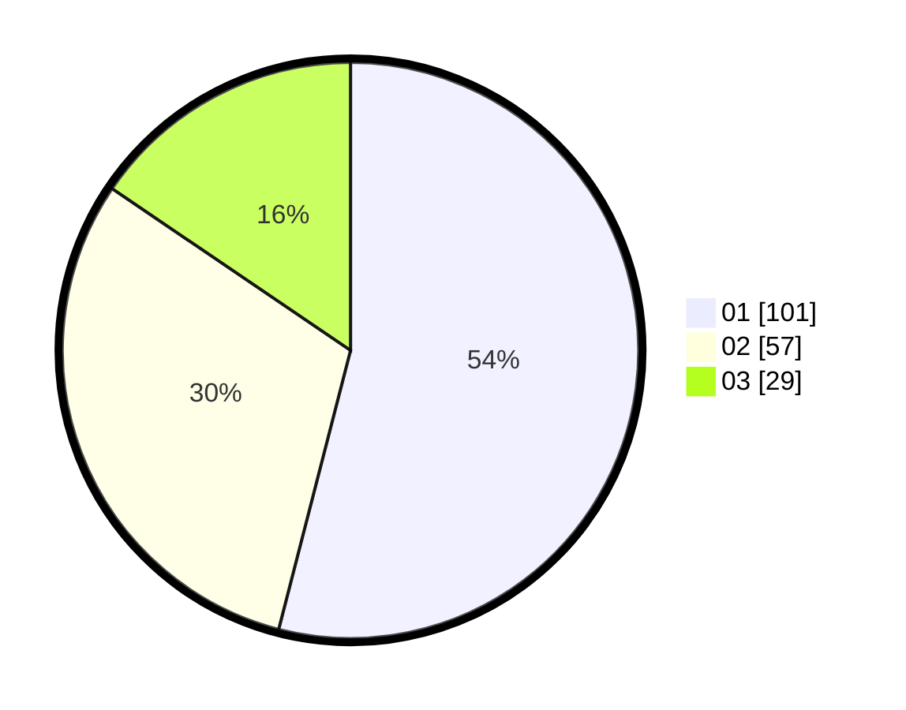

# Hasil

Hasil perolehan suara paslon dapat dilihat pada file paslon-01.txt, paslon-02.txt, dan paslon-03.txt.

Jika tidak ada, artinya data tersebut belum ada pada SIREKAP.

## Perolehan Suara

 * Paslon 01: **101**.
 * Paslon 02: **57**.
 * Paslon 03: **29**.

## Foto C Plano

https://sirekap-obj-formc.kpu.go.id/748a/pemilu/ppwp/31/74/04/10/06/3174041006068-20240214-155700--58a93133-9d21-4459-8f40-0841b10ef7ad.jpg

https://sirekap-obj-formc.kpu.go.id/748a/pemilu/ppwp/31/74/04/10/06/3174041006068-20240214-185104--75a07f7c-8325-44ee-b95f-e66c1a780d9e.jpg

https://sirekap-obj-formc.kpu.go.id/748a/pemilu/ppwp/31/74/04/10/06/3174041006068-20240214-184956--efa6ac80-7a65-4425-8034-66804cd999b2.jpg

## DATA PEMILIH TETAP

Jumlah pemilih dalam DPT: **234**.
 * L: **116**.
 * P: **118**.

## DATA PENGGUNA HAK PILIH

Jumlah pengguna hak pilih dalam DPT: **184**.
 * L: **84**.
 * P: **100**.

Jumlah pengguna hak pilih dalam DPTb: **3**.
 * L: **1**.
 * P: **2**.

Jumlah pengguna hak pilih dalam DPK: **1**.
 * L: **0**.
 * P: **1**.

Jumlah pengguna hak pilih: **188**.
 * L: **85**.
 * P: **103**.

## JUMLAH SUARA SAH DAN TIDAK SAH

JUMLAH SELURUH SUARA SAH: **187**.

JUMLAH SUARA TIDAK SAH: **1**.

JUMLAH SELURUH SUARA SAH DAN SUARA TIDAK SAH: **188**.
