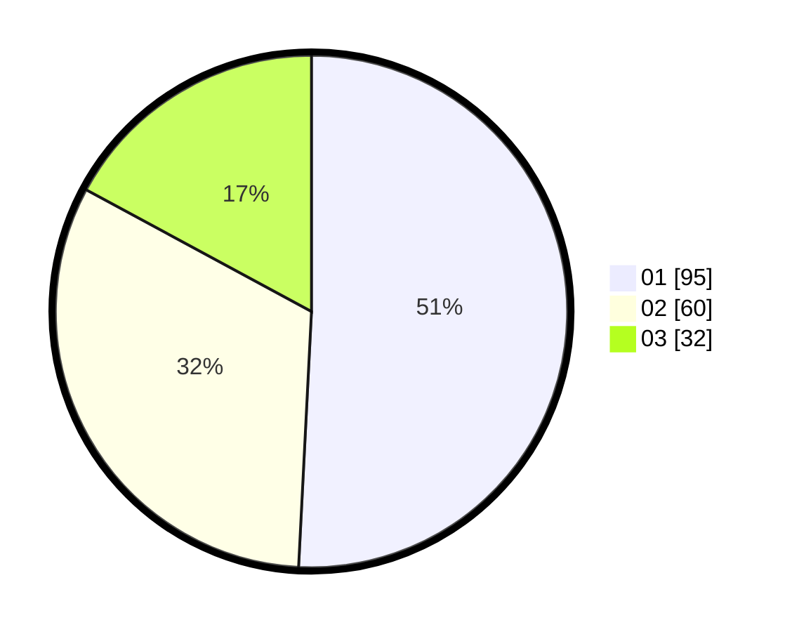

# Hasil

Hasil perolehan suara paslon dapat dilihat pada file paslon-01.txt, paslon-02.txt, dan paslon-03.txt.

Jika tidak ada, artinya data tersebut belum ada pada SIREKAP.

## Perolehan Suara

 * Paslon 01: **95**.
 * Paslon 02: **60**.
 * Paslon 03: **32**.

## Foto C Plano

https://sirekap-obj-formc.kpu.go.id/d29c/pemilu/ppwp/31/74/04/10/06/3174041006069-20240214-192454--f9ddce7f-d273-4434-8955-a87cd7cfc98e.jpg

https://sirekap-obj-formc.kpu.go.id/d29c/pemilu/ppwp/31/74/04/10/06/3174041006069-20240214-192510--e5007bcf-1992-40b7-91d9-dbc4c0dce7ce.jpg

https://sirekap-obj-formc.kpu.go.id/d29c/pemilu/ppwp/31/74/04/10/06/3174041006069-20240214-192516--5a8a95c7-8fce-4005-90c9-ad1366568a15.jpg

## DATA PEMILIH TETAP

Jumlah pemilih dalam DPT: **232**.
 * L: **107**.
 * P: **125**.

## DATA PENGGUNA HAK PILIH

Jumlah pengguna hak pilih dalam DPT: **185**.
 * L: **83**.
 * P: **102**.

Jumlah pengguna hak pilih dalam DPTb: **1**.
 * L: **1**.
 * P: **0**.

Jumlah pengguna hak pilih dalam DPK: **2**.
 * L: **1**.
 * P: **1**.

Jumlah pengguna hak pilih: **188**.
 * L: **85**.
 * P: **103**.

## JUMLAH SUARA SAH DAN TIDAK SAH

JUMLAH SELURUH SUARA SAH: **187**.

JUMLAH SUARA TIDAK SAH: **1**.

JUMLAH SELURUH SUARA SAH DAN SUARA TIDAK SAH: **188**.
