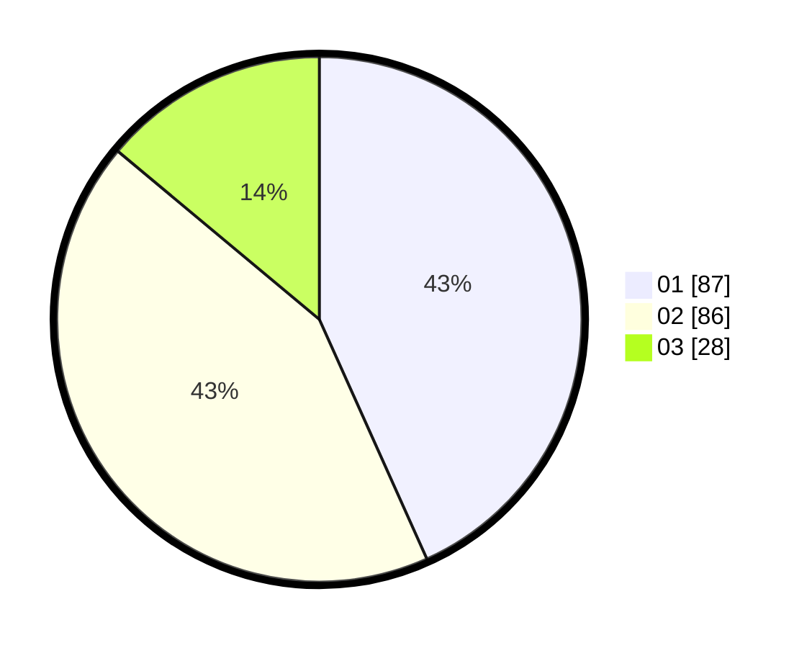

# Hasil

Hasil perolehan suara paslon dapat dilihat pada file paslon-01.txt, paslon-02.txt, dan paslon-03.txt.

Jika tidak ada, artinya data tersebut belum ada pada SIREKAP.

## Perolehan Suara

 * Paslon 01: **87**.
 * Paslon 02: **86**.
 * Paslon 03: **28**.

## Foto C Plano

https://sirekap-obj-formc.kpu.go.id/ea24/pemilu/ppwp/31/74/04/10/06/3174041006072-20240214-185648--a6c51a51-0513-4486-ab60-04530f1ccdee.jpg

https://sirekap-obj-formc.kpu.go.id/ea24/pemilu/ppwp/31/74/04/10/06/3174041006072-20240214-185539--81d554c8-07f5-4d60-a5e8-eb4644340ad0.jpg

https://sirekap-obj-formc.kpu.go.id/ea24/pemilu/ppwp/31/74/04/10/06/3174041006072-20240214-190016--8d473618-7fb3-4524-984e-315d8390e403.jpg
