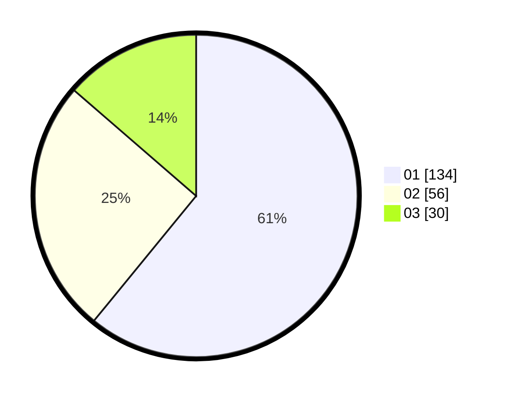

# Hasil

Hasil perolehan suara paslon dapat dilihat pada file paslon-01.txt, paslon-02.txt, dan paslon-03.txt.

Jika tidak ada, artinya data tersebut belum ada pada SIREKAP.

## Perolehan Suara

 * Paslon 01: **134**.
 * Paslon 02: **56**.
 * Paslon 03: **30**.

## Foto C Plano

https://sirekap-obj-formc.kpu.go.id/71c8/pemilu/ppwp/31/74/04/10/06/3174041006074-20240214-200813--58e76fdd-a51d-4ddd-a527-be5013ebe29b.jpg

https://sirekap-obj-formc.kpu.go.id/71c8/pemilu/ppwp/31/74/04/10/06/3174041006074-20240214-200821--89ab6dff-f0fc-41bd-b925-a95ff5fe0b1f.jpg

https://sirekap-obj-formc.kpu.go.id/71c8/pemilu/ppwp/31/74/04/10/06/3174041006074-20240214-200827--29d04f9e-571d-470a-bb34-3e4375685513.jpg

## DATA PEMILIH TETAP

Jumlah pemilih dalam DPT: **270**.
 * L: **121**.
 * P: **149**.

## DATA PENGGUNA HAK PILIH

Jumlah pengguna hak pilih dalam DPT: **218**.
 * L: **96**.
 * P: **122**.

Jumlah pengguna hak pilih dalam DPTb: **7**.
 * L: **2**.
 * P: **5**.

Jumlah pengguna hak pilih dalam DPK: **0**.
 * L: **0**.
 * P: **0**.

Jumlah pengguna hak pilih: **225**.
 * L: **98**.
 * P: **127**.

## JUMLAH SUARA SAH DAN TIDAK SAH

JUMLAH SELURUH SUARA SAH: **220**.

JUMLAH SUARA TIDAK SAH: **5**.

JUMLAH SELURUH SUARA SAH DAN SUARA TIDAK SAH: **225**.
