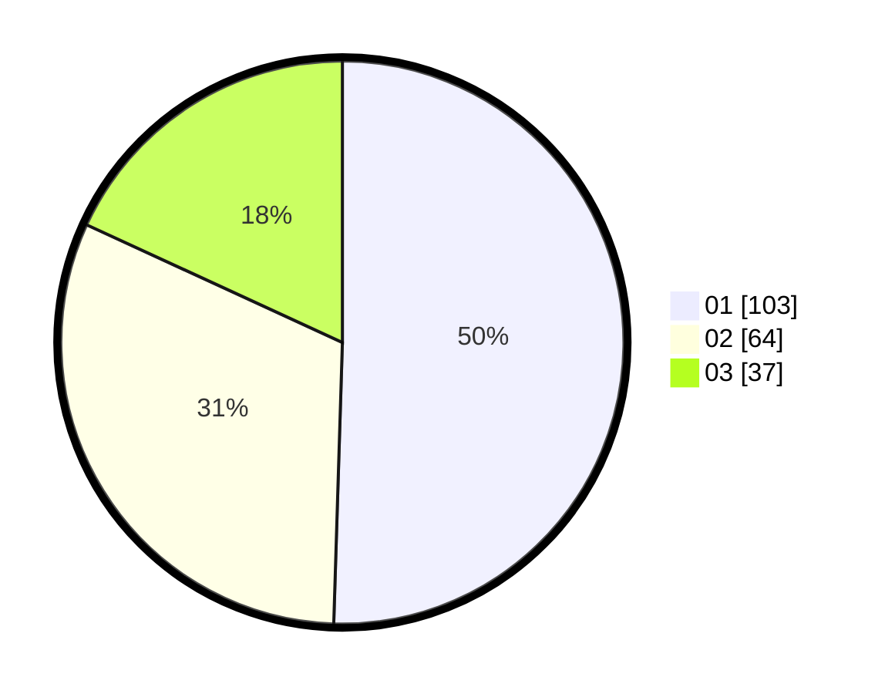

# Hasil

Hasil perolehan suara paslon dapat dilihat pada file paslon-01.txt, paslon-02.txt, dan paslon-03.txt.

Jika tidak ada, artinya data tersebut belum ada pada SIREKAP.

## Perolehan Suara

 * Paslon 01: **103**.
 * Paslon 02: **64**.
 * Paslon 03: **37**.

## Foto C Plano

https://sirekap-obj-formc.kpu.go.id/580e/pemilu/ppwp/31/74/04/10/06/3174041006076-20240214-191933--71514a31-d03e-4ee4-8fbe-ed4288b27db9.jpg

https://sirekap-obj-formc.kpu.go.id/580e/pemilu/ppwp/31/74/04/10/06/3174041006076-20240214-213507--a7ec2c68-6ae8-44a6-ace2-79fa885b9d36.jpg

https://sirekap-obj-formc.kpu.go.id/580e/pemilu/ppwp/31/74/04/10/06/3174041006076-20240214-213615--b72b1b3d-1c8e-4f0f-b5a6-2a31b97df5d2.jpg

## DATA PEMILIH TETAP

Jumlah pemilih dalam DPT: **261**.
 * L: **124**.
 * P: **137**.

## DATA PENGGUNA HAK PILIH

Jumlah pengguna hak pilih dalam DPT: **197**.
 * L: **88**.
 * P: **109**.

Jumlah pengguna hak pilih dalam DPTb: **12**.
 * L: **1**.
 * P: **11**.

Jumlah pengguna hak pilih dalam DPK: **2**.
 * L: **1**.
 * P: **1**.

Jumlah pengguna hak pilih: **211**.
 * L: **90**.
 * P: **121**.

## JUMLAH SUARA SAH DAN TIDAK SAH

JUMLAH SELURUH SUARA SAH: **204**.

JUMLAH SUARA TIDAK SAH: **7**.

JUMLAH SELURUH SUARA SAH DAN SUARA TIDAK SAH: **211**.
