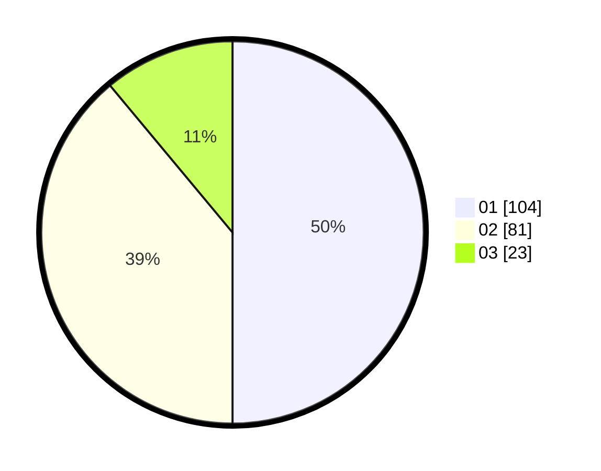

# Hasil

Hasil perolehan suara paslon dapat dilihat pada file paslon-01.txt, paslon-02.txt, dan paslon-03.txt.

Jika tidak ada, artinya data tersebut belum ada pada SIREKAP.

## Perolehan Suara

 * Paslon 01: **104**.
 * Paslon 02: **81**.
 * Paslon 03: **23**.

## Foto C Plano

https://sirekap-obj-formc.kpu.go.id/65ac/pemilu/ppwp/31/74/04/10/06/3174041006077-20240214-155050--c5c38822-b3c7-4318-9a24-f7b40ef9ea4d.jpg

https://sirekap-obj-formc.kpu.go.id/65ac/pemilu/ppwp/31/74/04/10/06/3174041006077-20240214-155101--0251b1c2-cfba-43c5-9c60-c249089ffd7e.jpg

https://sirekap-obj-formc.kpu.go.id/65ac/pemilu/ppwp/31/74/04/10/06/3174041006077-20240214-155458--d897fffa-13ef-450d-a656-7ce2f65140a5.jpg

## DATA PEMILIH TETAP

Jumlah pemilih dalam DPT: **264**.
 * L: **132**.
 * P: **132**.

## DATA PENGGUNA HAK PILIH

Jumlah pengguna hak pilih dalam DPT: **196**.
 * L: **95**.
 * P: **101**.

Jumlah pengguna hak pilih dalam DPTb: **16**.
 * L: **9**.
 * P: **7**.

Jumlah pengguna hak pilih dalam DPK: **0**.
 * L: **0**.
 * P: **0**.

Jumlah pengguna hak pilih: **212**.
 * L: **104**.
 * P: **108**.

## JUMLAH SUARA SAH DAN TIDAK SAH

JUMLAH SELURUH SUARA SAH: **208**.

JUMLAH SUARA TIDAK SAH: **4**.

JUMLAH SELURUH SUARA SAH DAN SUARA TIDAK SAH: **212**.
