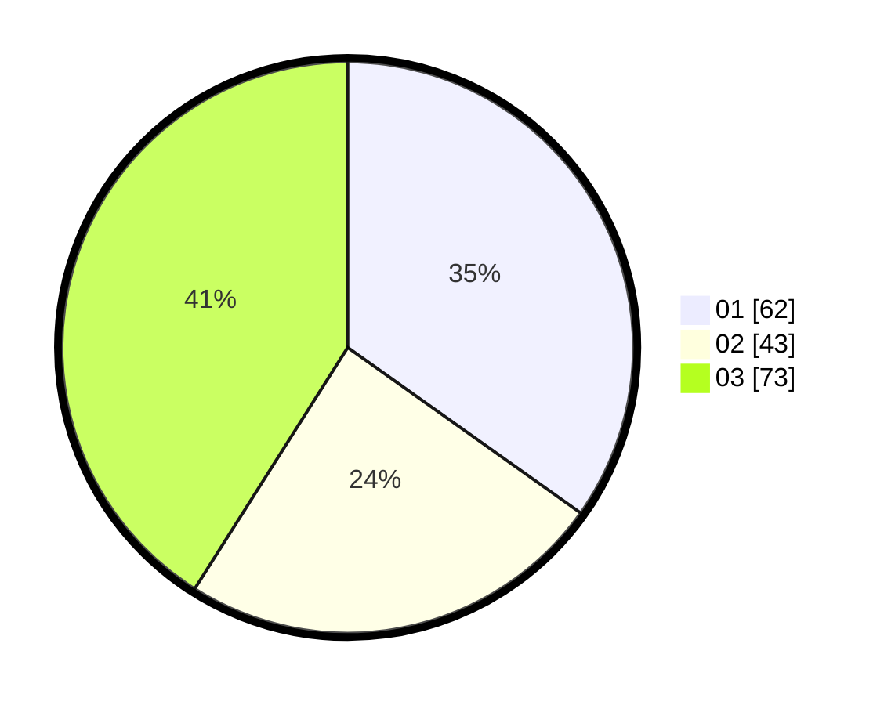

# Hasil

Hasil perolehan suara paslon dapat dilihat pada file paslon-01.txt, paslon-02.txt, dan paslon-03.txt.

Jika tidak ada, artinya data tersebut belum ada pada SIREKAP.

## Perolehan Suara

 * Paslon 01: **62**.
 * Paslon 02: **43**.
 * Paslon 03: **73**.

## Foto C Plano

https://sirekap-obj-formc.kpu.go.id/19b0/pemilu/ppwp/31/74/04/10/06/3174041006082-20240214-191653--fde166df-f460-4998-a9ef-378d7af5570f.jpg

https://sirekap-obj-formc.kpu.go.id/19b0/pemilu/ppwp/31/74/04/10/06/3174041006082-20240214-223838--a5e48cf7-de7d-4c8b-88d2-e6e6b68b94ae.jpg

https://sirekap-obj-formc.kpu.go.id/19b0/pemilu/ppwp/31/74/04/10/06/3174041006082-20240214-191724--7574fd12-0b9d-45e7-b2fe-75b49ce8c277.jpg

## DATA PEMILIH TETAP

Jumlah pemilih dalam DPT: **181**.
 * L: **81**.
 * P: **100**.

## DATA PENGGUNA HAK PILIH

Jumlah pengguna hak pilih dalam DPT: **150**.
 * L: **67**.
 * P: **83**.

Jumlah pengguna hak pilih dalam DPTb: **30**.
 * L: **10**.
 * P: **20**.

Jumlah pengguna hak pilih dalam DPK: **0**.
 * L: **0**.
 * P: **0**.

Jumlah pengguna hak pilih: **180**.
 * L: **77**.
 * P: **103**.

## JUMLAH SUARA SAH DAN TIDAK SAH

JUMLAH SELURUH SUARA SAH: **178**.

JUMLAH SUARA TIDAK SAH: **2**.

JUMLAH SELURUH SUARA SAH DAN SUARA TIDAK SAH: **180**.
